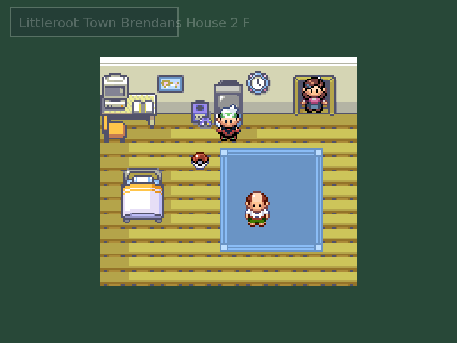
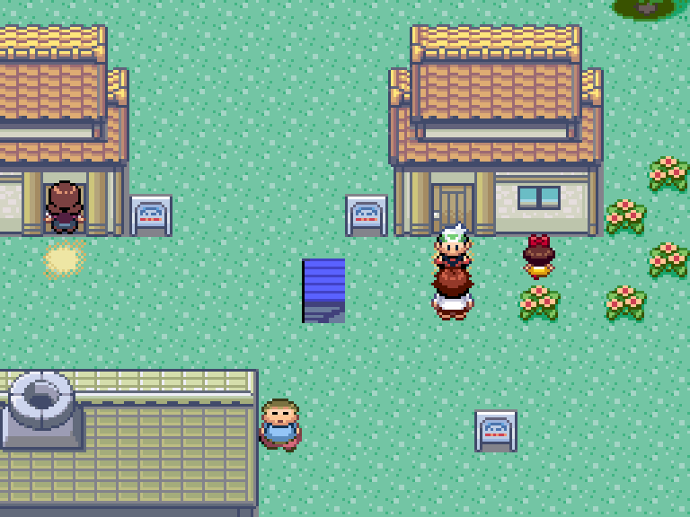
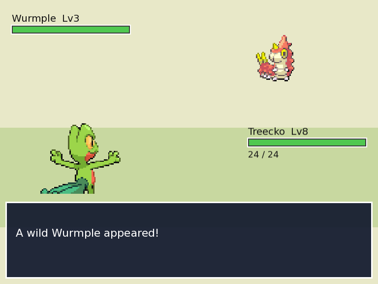
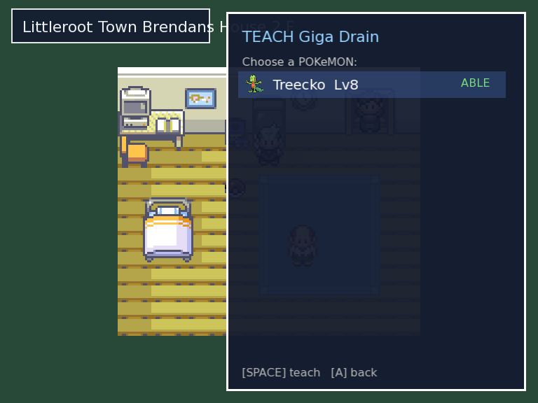

# Cod-é-mon — a Pokémon clone

A 2D tile-based game engine, written portably in C++, with a Pokémon Emerald–style
game (**Cod-e-mon**) built on top of it. Both cross-compile to Unix (macOS, Debian-based
Linux) and Windows 8+, using CMake as the build system and SFML (Simple and Fast
Multimedia Library) for graphics, audio and windowing.

Note: Don't sue me, Nintendo business daddy.

## What's actually in it

This isn't a tech demo with placeholder art — the world, the Pokémon, and the
mechanics are all imported from a real **pokeemerald** (Pokémon Emerald
decompilation) checkout via `codemon/tools/pe_import.py`, then driven by an
independent C++ engine:

* **489 maps** rendered from the original tilesets, with real collision,
  warps/transitions (fades between maps), signs, and NPCs placed exactly where
  they are in-game.
* **A cooperative script VM** that runs pokeemerald's own event scripts —
  NPC dialog (multi-page, `\x1f`-separated), movement scripts, coordinate
  triggers, flags/vars — so NPCs and story events behave like the original.
* **A full turn-based battle system**: 385 species with real base stats,
  types and growth curves; 354 moves with power/type/accuracy; a 17-type
  effectiveness chart; STAB; the physical/special split by move type; wild
  encounters and 854 trainer battles with real parties.
* **Progression**: EXP gain and 6 species-specific growth curves, level-up
  stat recalculation, learning the correct move at the correct level
  (411 learnsets), and 172 evolution paths — all pulled from source data, not
  guessed.
* **TM/HM teaching**: the bag lets you teach a held TM or HM to any party
  member, gated by that species' real TM/HM learnset (372 entries); TMs are
  consumed on use, HMs are reusable, exactly like Gen III.
* **Wild encounters** that match pokeemerald's `wild_encounters.json`
  per map — species, level ranges and Gen-3 slot weighting (20/20/10/10/…) —
  including cave/indoor floors that have encounters but no visible grass.
* **Story-accurate start**: new games begin in the player's bedroom
  (Brendan's House 2F) at the canonical heal-location tile, not a guessed
  spawn point, with an empty team and an empty bag (just the canonical 3000
  money) — no Pokémon or items until the real story hands them over, same as
  pokeemerald.
* **UI**: a start menu with Bag, Party, PC Box and PokéNav screens, capture
  and storage, item/type/species icons, an HP bar, a map-name banner on
  transitions, and a few overworld minigames (slots/roulette/blender/jump)
  using an in-game coin currency.
* **Audio**: Pokémon cries (wild encounters, trainer sends-out, switching),
  per-map background music, and battle/victory themes, all converted from
  the original MIDI to OGG and playing live, plus generated step/bump/select
  SFX.

Everything above is verified against the source data (not fabricated): the
import pipeline is data-driven, and every feature has been checked with
headless rendering (`CODEMON_SCREENSHOT=...`) against what pokeemerald
actually does for that map/species/trainer.

## Screenshots

<table>
<tr>
<td><br><sub>Story-accurate spawn: Brendan's House 2F</sub></td>
<td><br><sub>Littleroot Town, imported 1:1 from pokeemerald</sub></td>
</tr>
<tr>
<td><br><sub>Wild encounter on Route 102, matching the source encounter table</sub></td>
<td><br><sub>Teaching a TM from the bag, gated by the real learnset</sub></td>
</tr>
</table>

## Backstory

#### This part is 95% ok to skip — it's mostly rambling about why I started this

In 2010, when I first began to learn to code in a systematic way, I had
starry-eyed dreams of becoming a video games programmer. I think this is
likely a natural pipeline into computer science for many — game dev seems
like a lot of crunch for rarely enough pay, to me now. <br><br>
Any-hoozles. <br><br>
As I had at that time already learned Basic, and was learning C in my
highschool programming class, I decided to try my hand at a pure-C Pokémon
clone. I submitted it as a summative project. It never ran to my
satisfaction, and apparently it never ran at all on Mr. Krealman's PC. I got
a good grade anyway, somehow. (Thanks Mr. K.) <br>
It was a good piece of code for a highschooler — it had transitions, double
buffering, a working (much to my astonishment) camera system, battles, et
cetera. <br><br>
My issue was that it was never portable or reliable — simply put, 'twas
buggy as all get-out, and the amount of *ahem* assistance I received on the
project made me feel like it was never truly my work. (Thanks Geoffrey S.)
<br>
Now, having finally finished my formal education and amassed a decade or so
of practical experience, let's try our hand at reimplementing this solution.

#### TL;DR: this is an exercise in catharsis, as well as a way for me to gauge my growth as a dev

## Exec. summary

### A from-scratch C++/SFML reimplementation of Pokémon Emerald, with real data imported from pokeemerald

## Project goals

#### In no particular order, subject to change at any time as the mood strikes me

> Multiple maps
> > * Easy transitions between maps — "easy" meaning no noticeable loading
> >   times. ✅ done — warp fade, map-name banner
> > * Transition animations: wipes, fades. If you're thinking of early-2000s
> >   video-editing-software-style transitions, you're in the right ballpark.
> >   ✅ fade done; wipes not yet
>
> Wild Codemon areas
> > * A battle system ✅ done — turn-based, trainers + wild, capture
> > * RPG progression system inspired by, but hopefully not hopelessly
> >   derivative of, Pokémon. ✅ done — EXP, levels, evolution, TM/level-up
> >   movesets
>
> A map editor would be nice
> > * Procedural map generator — stochastic, probably noise-based. Not started;
> >   maps are currently imported 1:1 from pokeemerald.
>
> Music
> > * Jazz, maybe? MIDI→OGG conversion exists; the soundtrack itself is
> >   whatever pokeemerald ships.
>
> General goals
> > * No algorithms with runtimes beyond n·log(n)
> > * Unit-testing harness suite ✅ `codemon_tests`, wired into CTest
> > * Would be nice if the harness suite also timed each major algorithm
> >   automagically. Not yet.

## Sprites

Pokémon sprite artwork is pulled in from [PokeAPI/sprites](https://github.com/PokeAPI/sprites)
as a git submodule under `sprites/`. Clone the project with submodules to get it:

```sh
git clone --recurse-submodules <repo-url>
# or, in an existing checkout:
git submodule update --init --depth 1 sprites
```

## World & battle data from pokeemerald

The overworld, battle system and Pokémon data are all built from
**pokeemerald** source files, imported into engine-ready form by
`codemon/tools/pe_import.py` (see `codemon/tools/README.md`). That script is
the SFML-friendly replacement for the pokeemerald GBA build tools:

* **Tilesets** → fully coloured 16×16 metatile sheets in
  `codemon/assets/tilesets/` (palettes + metatile layers resolved at import
  time, so the engine just samples the sheet — no runtime palette work).
* **Maps** → `codemon/maps/*.map`: metatiles, collision, warps, NPCs (with
  dialog and movement scripts), signs, coordinate triggers, and wild
  encounter tables, one file per pokeemerald map.
* **Characters / NPCs** → every overworld walking sheet in
  `codemon/assets/overworld/` (16×32, 9-frame layout); the player and NPCs
  share the `Character` class, with east reusing west frames mirrored.
* **Battle data** → `codemon/assets/battle/*.tsv`: species (stats, types,
  growth curve, EXP yield), moves, level-up learnsets, TM/HM learnsets and
  the TM→move table, evolutions, and trainer parties.
* **Audio** → Pokémon cries plus generated step/bump/select blips in
  `codemon/assets/sfx/`, played through the `Audio` class. MIDI music is
  converted to OGG via fluidsynth/timidity + ffmpeg when installed (SFML
  can't play MIDI directly); each map's own `MUS_*` id is carried through
  into its `.map` file and resolved to `assets/sfx/music/<id>.ogg`.

Re-run or extend the import with:

```sh
pip install Pillow
python3 codemon/tools/pe_import.py all --src /path/to/pokeemerald-master
```

Licensing note: the imported graphics/audio/text remain Nintendo/Game Freak
property and are for non-commercial fan use only — see
`codemon/assets/CREDITS.md`.

## Building & running

The project builds with CMake and needs a system install of **SFML 2.5+**.

```sh
# Dependencies (Debian/Ubuntu)
sudo apt-get install libsfml-dev cmake g++

# Configure & build
cmake -S . -B build
cmake --build build

# Run the tests (headless, no display needed)
ctest --test-dir build --output-on-failure

# Start the game (needs a display; maps/ and assets/ are copied next to the binary)
./build/codemon
```

**Controls**: WASD to move, Space/Enter to confirm/interact, `M` opens the
menu, `G` opens minigames (where available), hold `Shift` to run (once the
Running Shoes are received).

### Windows

Double-click **`run-windows.bat`** (or run it from a terminal) to configure,
build and start the game in one step:

```bat
run-windows.bat            :: Release build, then run
run-windows.bat Debug      :: Debug build, then run
```

It drives the same CMake build and, unless you set `SFML_DIR` yourself, links
the MSVC SFML bundled under `codemon\SFML` statically, so no separate SFML
install or DLLs are needed. It requires CMake and a C++ toolchain (e.g.
Visual Studio Build Tools). The older Visual Studio solution (`codemon.sln`)
is still present but uses machine-specific absolute paths; the batch/CMake
path is preferred.

### Headless / CI mode

The game binary supports rendering off-screen to PNGs for testing and demos —
useful under `xvfb-run` in CI, with no window needed:

```sh
CODEMON_SCREENSHOT=out.png CODEMON_FRAMES=20 \
CODEMON_WALK=N,N,E,T,M,S,G \
xvfb-run -a ./build/codemon
```

Key env vars: `CODEMON_MAP` (start map), `CODEMON_WALK` (a comma-separated
token script: `N/S/E/W` move, `T` talk/advance dialog, `M` toggle menu, `G`
toggle minigames), `CODEMON_FRAMES`, `CODEMON_FORCE_ENCOUNTER` /
`CODEMON_NO_WILD`, `CODEMON_GRANT_EXP` (grant the starter EXP, to see
level-ups/evolution in one shot), `CODEMON_NO_SAVE` (ignore an existing
`savegame.dat` and start fresh), and `CODEMON_TEST_SCRIPT` (run a script by
its label immediately at startup — handy for exercising a specific event
script, e.g. a legendary encounter, without navigating to it in-world).

## Testing

`codemon_tests` exercises the display-independent core logic (`Coordinates`,
`Tile`, the hand-rolled `Linked_list`) and is wired into CTest.

## Project status

A snapshot of what's real right now versus what's still missing, based on a
full audit of the engine (`codemon/*.cpp/.h`), the ScriptVM opcode dispatch
cross-checked against every opcode actually used across all 489 imported
maps, and the importer. This is not aspirational — everything marked done
has been verified either by an automated test or by headless screenshot
(`CODEMON_SCREENSHOT=...`) against what pokeemerald actually does.

### ✅ What works

* Map rendering, collision, warps/transitions, signs, coordinate triggers,
  NPC placement & movement types (static/wander/pace), load triggers
* Seamless map connections (pokeemerald's edge-to-edge world stitching --
  Route101's north edge continuing into Oldale Town, etc.), on top of
  door/warp transitions; smooth per-tile sliding movement (camera included)
  driven by steady per-frame input polling instead of OS key-repeat timing
* Cooperative script VM (`ScriptVM`) running pokeemerald's real event
  scripts: dialog (multi-page), flags/vars, `goto`/`call` + `eq`/`ne`/`set`/
  `unset` conditionals, `switch`/`case`, movement scripts, `giveitem`/
  `finditem`, `setmetatile`
* Turn-based battles: 385 species (real stats/types/growth curve), 354
  moves (power/type/accuracy/effect data parsed), 17-type effectiveness
  chart, STAB, physical/special split, an accuracy roll on every move, wild
  encounters (real per-map tables + Gen-3 slot weighting), 854 trainer
  battles with real parties, trainer rematches
* Status conditions — sleep, poison, toxic, burn, paralysis, freeze, and
  confusion — driven by each move's real pokeemerald effect data (Toxic,
  Thunder Wave, Sleep Powder, Will-O-Wisp, Confuse Ray, and the % secondary
  chance on hits like Body Slam/Ice Beam/Flamethrower/Poison Sting), with
  real turn-blocking, end-of-turn damage, paralysis' quartered Speed, burn's
  halved physical damage, and Gen-3 type immunities
* Switching Pokémon mid-battle (a POKéMON option in the action menu), and
  surviving a faint by switching to a healthy party member instead of an
  automatic loss — the battle only ends once the whole team is down
* Real win/loss gating on scripted trainer battles (gym leaders, the Elite
  Four, the Champion, every ordinary trainer): losing no longer continues
  the "you won" story script that follows the battle command — instead the
  team is healed and the player is whited out back to the last Pokémon
  Center visited, same as losing any battle in the real games (including
  random wild encounters)
* Capture mechanic (approximate probability, Poké Ball only — see below)
* Scripted legendary/static encounters (Regirock/Regice/Registeel,
  Rayquaza, Kyogre/Groudon, Kecleon, the New Mauville Voltorb swarm) via
  `setwildbattle`/`dowildbattle`, with a real WON/LOST/RAN/CAUGHT battle
  outcome scripts can branch on (`specialvar VAR_RESULT GetBattleOutcome`)
* Mossdeep Gym's rotating-tile floor puzzle (and Trick House Puzzle #7's
  identical mechanic): pressing a switch actually shifts and re-faces every
  character standing on that color's arrow tiles, ported from pokeemerald's
  real metatile-driven algorithm
* Cut as a real field move: a party member that knows it (taught via HM01)
  can chop down any of the game's cuttable trees (`checkpartymove`,
  `bufferpartymonnick`/`buffermovename` message interpolation,
  `removeobject` permanently clearing the tree, gated on the first Badge,
  same checks/messages as pokeemerald) — Rock Smash uses the identical
  shared opcodes/script shape so it works the same way
* Running Shoes: once received (`FLAG_SYS_B_DASH`), holding Shift moves at
  the real games' exact 2x walk speed — the GBA's hold-B-to-run adapted to
  a PC control (there's no B button), same gated flag as the original
* All 4 in-game trades (Rustboro/Fortree/Pacifidlog/Battle Frontier Lounge6
  NPCs): a real party-list picker (`ChoosePartyMon`), species matching
  (`GetTradeSpecies`/`GetInGameTradeSpeciesInfo`, own stable species-id
  table in `BattleData`), and the swap itself (`CreateInGameTradePokemon`,
  matched level like the original — no IVs/personality/held mail here,
  same as nothing else in this engine has those either)
* EXP gain, all 6 species growth curves, level-up stat recalculation,
  level-up movesets (411 learnsets), **level-up evolution** (172 paths) —
  including a real EXP bar (progress to next level, same growth-curve math
  as the gain itself), shown under the active mon's HP bar in battle and
  next to each party member in the POKéMON menu; EXP gain/level-up/move-
  learned/evolution text already existed, just no visual bar before
* TM/HM teaching from the bag, gated by real per-species learnsets (372
  entries); TMs consumed on use, HMs reusable (this was silently broken for
  *every* TM/HM the whole time before — see the fix note below)
* Surf: badge-gated water-tile classification (pokeemerald's own surfable
  metatile behaviors), a held-Shift-style Ja/Nein prompt the first time you
  approach open water, automatic dismount back on dry land, and its own
  water wild-encounter table (5-slot Gen-3 rates) — without this, roughly
  the entire back half of Hoenn (Mossdeep, Sootopolis, Ever Grande/the
  Pokémon League itself) was unreachable
* Strength: activating it is the same generic `checkpartymove`/Ja-Nein/
  `setflag FLAG_SYS_USE_STRENGTH` script shape Cut and Surf already use (so
  it worked for free), plus a new native push mechanic in `player_step()`
  mirroring pokeemerald's `TryPushBoulder` — walking into a
  `misc_pushable_boulder` NPC with Strength active shoves it one tile
  further in the same direction (checked for bounds/collision/water) instead
  of just blocking, gating every Trick House/Seafloor Cavern/Victory Road
  boulder puzzle
* Waterfall: same water-tile infrastructure as Surf, plus its own
  MB_WATERFALL metatile classification — climbing one (moving north into it
  while already surfing) prompts the same Ja/Nein pattern; any other
  direction/approach (floating down or across its base) stays ordinary open
  water, matching pokeemerald's `IsPlayerSurfingNorth` check. Gates Route
  119, Meteor Falls, Route 114, Victory Road B2F, the Ever Grande/Battle
  Frontier/Safari Zone Southeast waterfalls
* Fly: a new FLIEGEN entry in the start menu lists every town/city actually
  visited (pokeemerald's `MAP_SCRIPT_ON_TRANSITION` unconditionally setting
  that map's own `FLAG_VISITED_*`, now tracked on every map entry) and warps
  straight to it, landing at the same tile as that town's own heal location.
  Gated on the team knowing FLY (badge check omitted, same simplification
  already used for Surf/Strength/Waterfall)
* Scripted multi-NPC cutscenes: `applymovement`/`addobject`/`removeobject`/
  `hideobject`/`showobject` targeting a specific object event by its
  `LOCALID_*` name (not just "the NPC just talked to"), e.g. Petalburg Gym's
  Wally tutorial battle
* `multichoice`/`multichoicedefault` prompts: a real cursor-driven option
  list (fishing quality, contest info, the Game Corner shop, the Trick
  House's 15-question Mechadoll trivia puzzle, the Devon Corp fossil choice,
  ...) — 55 option lists hand-resolved from pokeemerald's own C source
  (`src/data/script_menu.h`/`strings.c`) for every already-imported
  non-Battle-Frontier use
* Using healing/revive/status-curing bag items (Potion family, soft drinks,
  berries, Revive/Max Revive, Antidote/Paralyze Heal/Awakening/Burn Heal/
  Ice Heal/Full Heal/Full Restore) on a chosen party member, with real
  Gen-3 heal amounts and status-cure matching
* Shops (`pokemart`) and Ja/Nein prompts via the VM block-and-resume pattern
* Story-accurate start (Brendan's House 2F, canonical heal-location tile,
  empty team/bag until the real story hands them over)
* A real title screen at launch (real interactive play only — headless
  screenshot tests and `CODEMON_MAP` demos still load straight into a map,
  same as before): FORTSETZEN/NEUES SPIEL when a save exists, just NEUES
  SPIEL otherwise. No licensed title logo art was importable (the intro
  cutscene's own animated assets are all there, just no wordmark), so it's
  text-only, styled like the rest of the UI. Previously the game skipped
  straight into gameplay on launch with no menu at all
* UI: start menu (Bag/Party/PC Box/PokéNav), map-name banner, HP bars,
  item/type/species icons, Pokémon Center heal (whole team) + its glowing-
  Pokéball/monitor animation
* Overworld minigames: Slot Machine, Roulette, Berry Blender, Pokémon Jump
  (real gameplay, not stubs), with an in-game coin currency
* Save/load: a SPEICHERN entry in the main menu writes the whole run (map,
  position, flags/vars, bag, money, party, PC box) to `savegame.dat`;
  starting the game resumes from it automatically
* Audio: step/bump/select SFX, per-map background music (switches on every
  map transition/warp/fly), Pokémon cries (wild encounters, trainer
  send-outs, mid-battle switches, `playmoncry` field scripts), battle/
  victory themes (wild, trainer, gym leader/champion/rival/Elite Four
  variants), and `playbgm` field-script music cues all play natively
* Gen-3 in-battle stat stages (-6..+6, Attack/Defense/Sp.Atk/Sp.Def/Speed/
  accuracy/evasion): every stat-changing move (Growl, Leer, Swords Dance,
  Bulk Up, Calm Mind, Haze, ~50 in total) actually raises/lowers the right
  stat now, with the real "won't go any higher!" cap message; stages reset
  whenever a side's active mon changes, same as the real games
* `codemon_tests` / CTest for the display-independent core data structures

### ⚠️ Partial / simplified

* **Battle system** is a simplified 1v1 damage calculator: no critical hits,
  no move priority, no weather, no abilities, no held items, no IV/EV/
  natures, no PP/Struggle, no doubles, no EXP Share (status conditions,
  accuracy, stat stages, mid-battle switching and faint recovery are
  implemented, see above)
* **Catch mechanic** is a flat approximate formula, independent of species
  catch rate or ball type (only `ITEM_POKE_BALL` exists functionally)
* **Evolution**: level-up only; stone/trade/friendship evolutions are
  imported into data but never triggered in-game
* **Audio**: `playse` (one-off pokeemerald SE_* sound effects beyond
  step/bump/select) is still a no-op — only the small hand-made SFX set was
  imported, not every original SE_* WAV; `MUS_ROUTE118`'s real behavior
  (dynamic pick between MUS_ROUTE110/MUS_ROUTE119 by player x position) is
  simplified to a static MUS_ROUTE119 default; Battle Frontier's own
  MUS_B_* tracks convert but that mode isn't implemented (see below)
* **Text interpolation** (`bufferstring` family): the importer bakes static
  values into dialog at import time, but genuinely dynamic values (e.g.
  Birch's Pokédex-seen/caught rating) render with the number missing
* **`specialvar` opcode**: `GetBattleOutcome` and `PlayerHasBerries` return
  real answers; everything else (`ShouldTryRematchBattle`, Pokérus, trading,
  breeding, contests, the fan club, Trainer Hill, ...) honestly returns
  0/false since those systems don't exist here, rather than faking one

### ❌ Not implemented yet

* Gift/fossil Pokémon (`givemon`: Johto starters, Beldum, Castform, fossils)
* HM field moves other than Cut/Rock Smash/Surf/Strength/Waterfall/Fly
  (Flash/Dive) — Dive needs its own walk-onto-special-tile trigger (same
  shape as Surf/Waterfall, see above) and there's no assets/mechanic for its
  underwater maps yet
* Bike, day-night cycle, overworld weather, fishing, berry growing
* Pokédex screen (no seen/caught tracking), party summary/stats screen,
  player naming/gender selection, options/settings screen
* Multiple PC boxes (currently one unlimited list), item storage in the PC
* Breeding/eggs, contests, secret bases, Battle Frontier (Trading — the 4
  fixed NPC in-game trades — now works; there's no real link-cable trading
  since there's no second player)
* Door-open animations (purely cosmetic, no gameplay effect either way)
* A map editor / procedural map generator

### 🎯 Next-fix priority (walkthrough-ordered, per a Bulbapedia walkthrough audit)

Story content itself (dialogue, scripts, maps) is imported for the whole
game and translated through Rustboro Gym; these are the *systemic* gaps
found to actually block or break story progression, in the order they'd be
hit:

1. ~~Cut as a field move~~ — done: `checkpartymove`/`bufferpartymonnick`/
   `buffermovename`/`removeobject` implemented in `ScriptVM`, badge-gated
   cuttable trees now work exactly like pokeemerald (Rock Smash rides along
   for free, same shared opcodes/script shape). Surf/Strength/Waterfall/Fly/
   Dive still aren't implemented but aren't needed this early.
2. ~~Running Shoes' run mechanic~~ — done: gated on `FLAG_SYS_B_DASH`,
   holding Shift (the PC-appropriate stand-in for the GBA's B button) now
   moves at the real games' 2x walk speed.
3. ~~Trading~~ — done: all 4 fixed in-game trades (Rustboro's
   Seedot↔Ralts, Fortree's Plusle↔Volbeat, Pacifidlog's Horsea↔Bagon,
   Battle Frontier Lounge6's Meowth↔Skitty) work via a real party picker
   and species matching. No real link-cable trading (no second player) --
   trade evolutions (Kadabra, Machoke, Graveler, Haunter) still can't
   happen, same as the rest of Evolution being level-up only.
4. ~~`goto_if_ge/gt/lt/le`/`multichoice` audit~~ — done. Findings:
   - `goto_if_ge/gt/lt/le` **and** `call_if_ge/gt/lt/le` (33 files) — implemented,
     same pattern as `goto_if_eq`/`call_if_eq`. Mostly Battle Frontier/Contest
     Hall score thresholds, but also real story content.
   - `checkitem`/`removeitem` result vars (51/23 files) — implemented, wired
     to the existing bag (`GameState::item_count`/`take_item`). Verified on
     Devon Corp's fossil hand-off quest (Rustboro), which also needed
     `bufferitemname` (found along the way, same missing-opcode class) —
     now correctly shows "PLAYER handed the ROOT FOSSIL to the DEVON
     RESEARCHER." and removes it from the bag.
   - `multichoice` (115 files, ~90% Battle Frontier) — at the time of this
     audit, not implemented. Its option text isn't in any script file
     pokeemerald ships per-map (it's a fixed C array, `gMultichoiceLists`),
     so each non-Battle-Frontier use needs its own hand-transcribed option
     list, not a single generic fix. **Since implemented** — see below.
   - `addobject`/`hideobject`/`showobject` (41/0/0 files) — at the time of
     this audit, not implemented, and bigger than expected: this engine had
     no LOCALID→object registry at all (`ScriptVM::resolve()` only knew
     "the player" or "the NPC just talked to"), so scripts that spawn an
     NPC mid-scene by id -- e.g. Petalburg Gym's Wally tutorial battle
     cutscene (`addobject LOCALID_PETALBURG_GYM_WALLY`) -- did nothing when
     they tried. **Since implemented** — see below.
   - `opendoor`/`closedoor`/`waitdooranim` — confirmed purely cosmetic
     (metatile swap + SFX; door tiles are already walkable independent of
     the animation), left as no-ops.
5. ~~Playthrough-blocker audit~~ — done, prompted by "can we actually finish
   the game right now?". Two real blockers found and fixed:
   - **TM/HM teaching was completely broken for every TM and HM in the
     game**, Cut included — `Menu.cpp` assumed bag items were named like
     `ITEM_HM03`, but pokeemerald's real item constants are descriptive
     (`ITEM_HM_CUT`, `ITEM_TM_BULK_UP`, ...), so the derived move was
     always garbage and teaching always silently failed ("Es passiert
     nichts."). Fixed by reading the move straight off the item name
     (pokeemerald builds those constants from the move name itself, so no
     numeric code is even needed) — verified headlessly teaching both an
     HM and a TM.
   - **Surf didn't exist at all**, and worse, water wasn't even collision-
     blocked, so the "back half" of Hoenn (everything past Lilycove --
     Mossdeep, Sootopolis, and Ever Grande/the Pokémon League itself, all
     only reachable over open water) was already walkable on foot with no
     Surf check, animation, or encounters at all. Fixed: real surfable-
     water metatile classification (mirroring how tall grass is already
     classified), a gate that blocks entry without Surf and prompts for it
     with the real games' own question text, automatic dismount back on
     land, and a water wild-encounter table.
6. ~~Strength as a field move~~ — done. Activating it needed no new VM code
   at all (`EventScript_StrengthBoulder` is the same
   `checkpartymove`/Ja-Nein/`setflag` shape Cut and Surf already use), but
   pushing the boulder is a walk-into-it collision, not an interaction, so it
   needed a new native mechanic in `player_step()` mirroring pokeemerald's
   `TryPushBoulder`: walking into a `misc_pushable_boulder` NPC while
   `FLAG_SYS_USE_STRENGTH` is set moves it one tile further (bounds/
   collision/water-checked) instead of just blocking, and the player only
   advances into its old tile on the *next* step, exactly like the original.
   Along the way, found and fixed a much bigger, unrelated bug this surfaced:
   any msgbox referencing a text label defined in `data/event_scripts.s`
   (pokeemerald's single biggest shared-script file — HM/badge flavour text,
   the PokéRus explanation, the department store elevator's floor prompt,
   ...) was rendering the raw label name (e.g. literally "Text_CantStrength")
   instead of real text, because the importer's global text pool only
   scanned `data/text/*.inc` and `data/scripts/*.inc`, never that file. Fixed
   in `pe_import.py` and back-filled non-destructively into the 74 already-
   imported `.map` files it affected (Pokémon Centers, Battle Frontier
   rooms, several routes, the Trick House/boulder rooms, ...) — 486 lines
   resolved to their real text. One text (`gStringVar4`, a runtime-formatted
   Battle Frontier buffer, not a static string) is legitimately out of scope
   for a static text pool and left as-is. Also fixed a second, narrower bug
   found while re-deriving the Strength text: the importer's `{STR_VAR_n}`
   handling dropped the token entirely instead of keeping it as the bare
   `STR_VAR_n` placeholder `ScriptVM`'s msgbox substitution actually looks
   for, silently eating the Pokémon's name out of "X used STRENGTH!"-style
   lines.
7. ~~Waterfall as a field move~~ — done: its own MB_WATERFALL metatile
   classification (new `waterfall` map-file section, mirroring `water`),
   gated on moving north into one while already surfing (pokeemerald's
   `IsPlayerSurfingNorth` check) — any other direction is just ordinary open
   water. Reused Surf's Ja/Nein-prompt plumbing directly (`needs_waterfall`/
   `pending_waterfall` alongside the existing `needs_surf`/`pending_surf`).
   Backfilled non-destructively into the 7 maps that actually have a
   waterfall (Route 119, Meteor Falls, Route 114, Victory Road B2F, Ever
   Grande City, Battle Frontier Outside East, Safari Zone Southeast).
8. ~~Fly as a field move~~ — done, but the biggest of the four so far: real
   Fly needs a region-map UI this engine has no assets/infrastructure for at
   all, so it's simplified to a FLIEGEN entry in the start menu listing
   every visited town/city as plain text. "Visited" itself didn't exist as
   data anywhere -- pokeemerald sets each town's `FLAG_VISITED_*` from its
   `MAP_SCRIPT_ON_TRANSITION` (not the `MAP_SCRIPT_ON_FRAME_TABLE` this
   engine already imports), sometimes indirectly through an unconditionally-
   called helper script (Slateport) or a coord_event near the entrance (Ever
   Grande, already covered by the existing trigger system with zero new
   code). Rather than tracing each town's call graph, the importer derives
   the expected flag name from the map's own folder name and just confirms
   it's really set somewhere in that map's scripts.inc (`derive_visited_flag`)
   -- true for exactly the 16 canFly towns/cities, matching pokeemerald's own
   `region_map.c` list. New `visit` map-file section (backfilled into those
   16 maps) makes `load_session` set the flag unconditionally on every entry;
   arrival tiles reuse each town's own heal-location coordinates (same spot
   recovering from a whiteout would use). Gated on the team knowing FLY, not
   a badge, same simplification as Surf/Strength/Waterfall.
9. ~~A per-map LOCALID→object registry~~ — done. `NpcSpawn` now carries the
   `LOCALID_*` name porymap gave an object event, if any (most don't have
   one) -- read straight off `map.json`'s own `local_id` field, so no
   fragile index/position matching was needed. `Session::localid_map` (name
   → `Character*`) is built in `load_session` and handed to `ScriptVM`,
   whose `resolve()` now checks it before falling back to "the NPC just
   talked to". A LOCALID-tagged NPC's `Character` is created even while its
   own `FLAG_HIDE_*` is set (unlike a plain hidden NPC, which is skipped
   entirely) so `addobject` has something to spawn; it just isn't added to
   the live actor list until then. `addobject`/`hideobject`/`showobject`
   are new opcodes that add/remove a resolved object from that list, nothing
   more — real pokeemerald's `removeobject` has no flag side effect, unlike
   this engine's existing one for Cut/Rock Smash's own trees (which
   permanently marks `FLAG_HIDE_*`/`FLAG_TEMP_*` and the object
   uninteractable, since that call is *never* LOCALID-resolved in practice —
   only ever the tree just interacted with). Verified end to end on
   Petalburg Gym's Wally tutorial cutscene (`addobject` spawning him,
   `applymovement` walking him into place by LOCALID, no crash across the
   whole scripted sequence) with no regression on Cut (a tree still cut and
   stays gone).
10. ~~`multichoice` support~~ — done. `MultiChoicePrompt` is a real
    cursor-driven option list (same block-and-resume VM pattern as the party
    picker/Ja-Nein prompt — a new `WAIT_MULTICHOICE` state, `wants_/
    resolve_multichoice()`); the picked index lands in `VAR_RESULT`, same
    contract as pokeemerald's own opcode. `multichoicedefault`'s extra
    default-selected-index argument is honored too. The option text itself
    isn't in any imported script file (it's `sMultichoiceLists[]`, a fixed C
    array indexed by a `MULTI_*` id, in `src/data/script_menu.h`), so it's a
    55-entry static table hand-resolved from that file plus the two places
    its actual text lives (`src/strings.c`'s `gText_*` string literals,
    `data/text/trick_house_mechadolls.inc`'s `.string` blocks) — covering
    every `MULTI_*` id an already-imported non-Battle-Frontier map actually
    references (fishing quality, contest info, the Game Corner shop, the
    Trick House's 15-question Mechadoll trivia puzzle, the Devon Corp fossil
    choice, ...). Battle Frontier's own ~100 uses are its own facility
    flavour text, left unresolved (falls through as a no-op, same as before
    this opcode existed) rather than transcribed sight unseen.

## To-do checklist

Everything checked off below has been verified working (test or headless
screenshot), not just written and assumed correct.

**Foundations**
- [x] Collision (per-tile layer, checked on move)
- [x] Bounds checking (`Map::in_bounds` / `Map::passable`)
- [x] Asset importer fully data-driven (`tools/pe_import.py`), no
      compile-time hardcoding
- [x] NPC behaviour, map transitions, warp fades
- [x] Seamless map connections (edge-to-edge, not just door/warp tiles)
- [x] Smooth sliding movement + camera, steady per-frame input polling
- [x] Unit-testing harness wired into CTest

**Battle & progression**
- [x] Turn-based battle system (trainers + wild, capture)
- [x] RPG progression (EXP, levels, level-up evolution, level-up movesets)
- [x] TM/HM teaching gated by real learnsets
- [x] Status conditions (paralysis/burn/poison/toxic/sleep/freeze/confusion)
      + a real per-move accuracy roll
- [ ] Critical hits, move priority
- [x] Stat-stage changes from status moves (-6..+6, all seven stats,
      compound effects like Bulk Up/Calm Mind/Haze included)
- [ ] Weather, abilities, held items, IV/EV/natures, PP/Struggle
- [x] Switching Pokémon mid-battle / surviving a faint with a healthy party
- [x] Whiteout on a lost battle (heal + warp to last heal location) instead
      of scripted trainer battles continuing their win dialogue on a loss
- [ ] Double battles, EXP Share
- [x] In-game trades (all 4 fixed NPC trades, real party picker)
- [ ] Stone/trade/friendship evolution triggers
- [ ] Ball-type-aware, catch-rate-aware capture formula

**Core loop**
- [x] Save/load system
- [x] Usable healing/revive/status-curing bag items outside TM/HM teaching
- [x] `specialvar` opcode — `GetBattleOutcome`/`PlayerHasBerries` real,
      the rest honestly default to 0/false (see above)
- [x] Scripted legendary/static encounters (`setwildbattle`/`dowildbattle`)
- [ ] Gift/fossil Pokémon (`givemon`)
- [x] Mossdeep Gym rotating-tile puzzle (also covers Trick House Puzzle #7)
- [x] Comparison `goto_if_ge/gt/lt/le`/`call_if_ge/gt/lt/le`,
      `checkitem`/`removeitem`/`bufferitemname`
- [x] LOCALID→object registry + `addobject`/`hideobject`/`showobject`
- [x] `multichoice`/`multichoicedefault` (real choice-menu UI, 55 resolved
      option lists)
- [ ] Door animations (cosmetic only, see audit above)

**Audio**
- [x] Step/bump/select SFX
- [x] Per-map background music (58 tracks, plays on load/warp/fly/whiteout)
- [x] Pokémon cries (wild encounters, trainer send-outs, mid-battle switches)
- [x] Battle/victory themes (wild, trainer, gym leader/champion/rival/Elite
      Four, wild/trainer victory jingles)
- [x] `ScriptVM`'s `playbgm`/`playmoncry` opcodes (field-script music/cry cues)
- [ ] `playse` (one-off SE_* sound effects beyond step/bump/select)

**Overworld features**
- [x] Overworld minigames (slots/roulette/blender/jump) with coin currency
- [x] Cut/Rock Smash field moves (badge-gated, real removeobject/text)
- [x] Surf (real water-tile gate, Ja/Nein prompt, dismount, water encounters)
- [x] Strength (native boulder-push collision mechanic, real activation text)
- [x] Waterfall (climbing gated on surfing north into it, real activation text)
- [x] Fly (FLIEGEN menu entry, visited-town tracking, real arrival tiles)
- [ ] Remaining HM field moves (Flash/Dive)
- [x] Running Shoes (hold Shift, gated on FLAG_SYS_B_DASH, real 2x speed)
- [ ] Bike
- [ ] Day-night cycle, overworld weather
- [ ] Fishing, berry growing

**UI**
- [x] Start menu: Bag, Party, PC Box, PokéNav
- [x] Pokémon Center full-team heal + animation
- [ ] Pokédex screen (seen/caught tracking)
- [ ] Party member summary/stats screen
- [ ] Player naming / gender selection
- [ ] Options/settings screen
- [ ] Multiple PC boxes, item storage in the PC

**Contests & Battle Frontier** (brought into scope; previously deferred)
- [ ] Contests (Cool/Beauty/Cute/Smart/Tough, judging, Contest Hall NPCs)
- [ ] Secret bases
- [ ] Battle Frontier (Tower/Dome/Palace/Arena/Factory/Pike/Pyramid)

**Out of scope for now (not silently faked, just not attempted)**
- [ ] Breeding/eggs (link-cable trading N/A -- no second player)
- [ ] Map editor / procedural map generator
