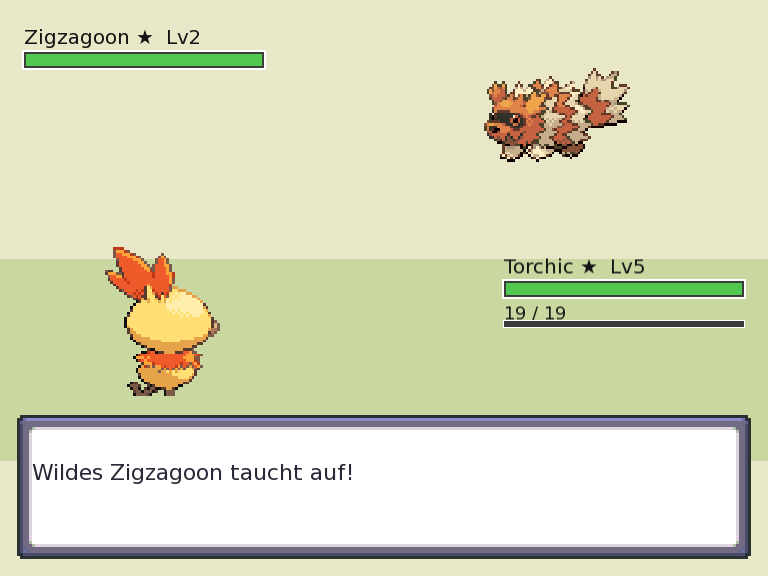

# Pokémon-Klon

Eine portabel in C++ geschriebene, kachelbasierte 2D-Spiel-Engine mit einem darauf aufbauenden Spiel im Stil von Pokémon Emerald. Projekt können mittels Cross-Compilation für Unix (macOS, Debian-basierte Linux-Systeme) und Windows 8+ erstellt werden. Als Build-System wird CMake verwendet, für Grafik, Audio und Fensterverwaltung kommt SFML (Simple and Fast Multimedia Library) zum Einsatz.

## Was tatsächlich enthalten ist

Dies ist keine Tech-Demo mit Platzhaltergrafiken – die Welt, die Pokémon und die Spielmechaniken werden aus einem echten **pokeemerald**-Checkout (Pokémon-Emerald-Decompilation) über `codemon/tools/pe_import.py` importiert und anschließend von einer unabhängigen C++-Engine ausgeführt:

✅ **489 Karten**, gerendert aus den originalen Tilesets, mit echter Kollisionslogik, Warps/Übergängen (Überblendungen zwischen Karten), Schildern und NPCs exakt an den Positionen des Spiels.

✅ Eine kooperative Script-VM**, die die originalen Event-Skripte von pokeemerald ausführt – NPC-Dialoge (mehrseitig, durch `\x1f` getrennt), Bewegungsskripte, Koordinaten-Trigger sowie Flags/Variablen – sodass NPCs und Story-Events wie im Original funktionieren.

✅ **Ein vollständiges rundenbasiertes Kampfsystem**: 385 Arten mit echten Basiswerten, Typen und Wachstumsverläufen; 354 Attacken mit Stärke/Typ/Genauigkeit; eine Effektivitätstabelle mit 17 Typen; STAB; physisch/spezial abhängig vom Attackentyp; wilde Begegnungen und 854 Trainerkämpfe mit echten Teams.

✅ **Fortschrittssystem**: EP-Gewinn und 6 artspezifische Wachstumsverläufe, Neuberechnung der Werte beim Levelaufstieg, Erlernen der korrekten Attacken auf den richtigen Leveln (411 Lernsets) und 172 Entwicklungswege – alles aus den Quelldaten übernommen und nicht geraten.

✅ **TM/HM-Lernen**: Über den Beutel können gehaltene TMs oder HMs jedem Teammitglied beigebracht werden, sofern die jeweilige Art den Move laut echtem TM/HM-Lernset lernen kann (372 Einträge). TMs werden bei der Verwendung verbraucht, HMs sind wiederverwendbar – genau wie in Gen III.

✅ **Wilde Begegnungen**, die pro Karte mit `wild_encounters.json` von pokeemerald übereinstimmen – Pokémon, Levelbereiche und Gen-3-Slot-Gewichtung (20/20/10/10/…) – einschließlich Höhlen-/Innenraumböden, auf denen Begegnungen stattfinden, obwohl kein sichtbares Gras vorhanden ist.

✅ **Storygetreuer Spielstart**: Neue Spiele beginnen im Schlafzimmer des Spielers (Brendans Haus 2F) auf dem kanonischen Heilpunkt, nicht an einem geratenen Spawnpunkt. Das Team und der Beutel sind leer (lediglich die kanonischen 3000 Geld sind vorhanden) – Pokémon und Items erhält der Spieler erst dann, wenn die echte Story sie übergibt.

✅ **Benutzeroberfläche**: Startmenü mit Beutel, Team, PC-Box und PokéNav, Fangen und Lagern von Pokémon, Item-/Typ-/Arten-Symbole, KP-Balken, Kartenname beim Übergang sowie einige Overworld-Minispiele (Spielautomat/Roulette/Beerenmixer/Pokémon-Sprung) mit einer spielinternen Münzwährung.

✅ **Audio**: Pokémon-Rufe (wilde Begegnungen, Trainer schicken Pokémon heraus, Wechsel), Karten-Hintergrundmusik sowie Kampf-/Siegesmusik. Die Musik wird von MIDI nach OGG konvertiert und während des Spiels abgespielt. Zusätzlich gibt es generierte Schritt-/Anstoß-/Auswahl-SFX.

Alles oben Genannte wurde anhand der Quelldaten überprüft und ist nicht frei erfunden: Die Import-Pipeline ist datengetrieben und jede Funktion wurde per Headless-Rendering (`CODEMON_SCREENSHOT=...`) gegen das tatsächliche Verhalten von pokeemerald für die jeweilige Karte/Art/Trainer überprüft.

## Screenshots

<table>
<tr>
<td><br><sub>Storygetreuer Spawn: Brendans Haus 2F</sub></td>
<td><br><sub>Littleroot Town, 1:1 aus pokeemerald importiert</sub></td>
</tr>
<tr>
<td><br><sub>Wilde Begegnung auf Route 102, entsprechend der Begegnungstabelle der Quelldaten</sub></td>
<td><br><sub>TM-Lernen aus dem Beutel, abhängig vom echten Lernset</sub></td>
</tr>
<tr>
<td><br><sub>Schillernde (shiny) Pokémon mit der echten zweiten Palette – 1/8192, hier per <code>CODEMON_FORCE_SHINY</code> erzwungen</sub></td>
<td></td>
</tr>
</table>

### Eine von Grund auf neu entwickelte C++/SFML-Neuimplementierung von Pokémon Emerald mit echten, aus pokeemerald importierten Daten

## Projektziele

#### Ohne besondere Reihenfolge, jederzeit änderbar – je nach Lust und Laune

> ✅ Originale Karten

> ✅ * Einfache Übergänge zwischen Karten – „einfach“ bedeutet ohne wahrnehmbare Ladezeiten.

> ✅ erledigt – Warp-Überblendung, Kartenname

> > * Übergangsanimationen: Wipes

> >   ✅ Fade erledigt; Wipes noch nicht

✅ Wilde Gebiete

✅ Kampfsystem erledigt – rundenbasiert, Trainer + wild, Fangen

✅ erledigt – EP, Level, Entwicklung, TM-/Level-Up-Attacken


> Musik
>
> *✅ MIDI→OGG-Konvertierung vorhanden; der Soundtrack entspricht dem, was pokeemerald bereitstellt.

> Allgemeine Ziele
>
> > * Keine Algorithmen mit einer Laufzeit oberhalb von n·log(n)
> > * Unit-Test-Testsuite `codemon_tests`, in CTest eingebunden
> > * Schön wäre es, wenn die Testsuite zusätzlich automatisch die Laufzeit jedes wichtigen Algorithmus messen würde. Noch nicht umgesetzt.

## Sprites

Die Pokémon-Sprite-Grafiken werden aus [PokeAPI/sprites](https://github.com/PokeAPI/sprites) als Git-Submodul unter `sprites/` eingebunden. Klone das Projekt inklusive Submodulen:

```sh
git clone --recurse-submodules <repo-url>
# oder bei einem bereits vorhandenen Checkout:
git submodule update --init --depth 1 sprites
```

## Welt- und Kampfdaten aus pokeemerald

✅ Die Overworld, das Kampfsystem und die Pokémon-Daten basieren vollständig auf den Quelldateien von **pokeemerald** und werden durch `codemon/tools/pe_import.py` in eine für die Engine geeignete Form importiert (siehe `codemon/tools/README.md`). Dieses Skript ersetzt die GBA-Build-Tools von pokeemerald auf SFML-kompatible Weise:

✅ **Tilesets** → vollständig eingefärbte 16×16-Metatile-Sheets in `codemon/assets/tilesets/` (Paletten und Metatile-Ebenen werden bereits beim Import aufgelöst, sodass die Engine nur noch aus dem Sheet lesen muss – keine Palettenberechnung zur Laufzeit).

✅ **Karten** → `codemon/maps/*.map`: Metatiles, Kollision, Warps, NPCs (mit Dialog- und Bewegungsskripten), Schilder, Koordinaten-Trigger und Wildbegegnungstabellen – eine Datei pro pokeemerald-Karte.

✅ **Charaktere/NPCs** → jedes Overworld-Laufsprite in `codemon/assets/overworld/` (16×32, 9-Frame-Layout). Spieler und NPCs verwenden dieselbe `Character`-Klasse; für die Laufrichtung nach Osten werden die westlichen Frames gespiegelt.

✅ **Kampfdaten** → `codemon/assets/battle/*.tsv`: Pokémon-Arten (Werte, Typen, Wachstumsverlauf, EP-Ausbeute), Attacken, Level-Up-Lernsets, TM/HM-Lernsets und TM→Attacke-Tabelle, Entwicklungen und Trainerteams.

✅ **Audio** → Pokémon-Rufe sowie generierte Schritt-/Anstoß-/Auswahl-Sounds in `codemon/assets/sfx/`, abgespielt über die `Audio`-Klasse. MIDI-Musik wird bei installiertem fluidsynth/timidity + ffmpeg in OGG konvertiert (SFML kann MIDI nicht direkt abspielen). Die jeweilige `MUS_*`-ID der Karte wird in deren `.map`-Datei übernommen und auf `assets/sfx/music/<id>.ogg` aufgelöst.

Import erneut ausführen oder erweitern:

```sh
pip install Pillow
python3 codemon/tools/pe_import.py all --src /path/to/pokeemerald-master
```

Lizenzhinweis: Die importierten Grafiken, Audiodateien und Texte bleiben Eigentum von Nintendo/Game Freak und sind ausschließlich für nicht-kommerzielle Fanprojekte vorgesehen – siehe `codemon/assets/CREDITS.md`.

## Die Region

✅ Die Spielwelt ist eine datengetriebene **Region** unter `codemon/region/`:

✅ Ein Manifest (`kanto.region`) sowie eine Kartendatei pro Gebiet verbinden ungefähr 30 Gebiete (Küstendorf → Städte → Wälder → Höhlen → Industrie → Inseln → ein monumentaler Bergkomplex) zu einer zusammenhängenden, in beide Richtungen begehbaren Welt.

✅ Die `Region`-Klasse (`codemon/Region.h`) lädt das Manifest ohne grafische Abhängigkeit von SFML. `main.cpp` bewegt den Spieler über Warp-Kacheln von Gebiet zu Gebiet. Siehe `codemon/region/README.md` für Geografie, Gebiete, Verbindungsgraph und Dateiformate.

Daten neu generieren:

```sh
python3 codemon/tools/gen_region.py
```

## Grafik & Audio

Die Terrain-Kacheln (`region/region_tiles.png`) und der Spielertrainer (`assets/Red_player.png`) wurden von scarloxys **„MyPixelWorld Special Packs #01“** abgeleitet (CC-BY 4.0). Die Quelldateien befinden sich unter `assets/art/`; die daraus erzeugten Sheets können mit folgendem Skript neu erstellt werden:

```sh
python3 codemon/tools/build_tiles.py
```

Das Spiel verwendet kurze **eigene** Platzhalter-Soundeffekte aus `assets/sfx/` (beispielsweise ein Anstoß-Sound bei blockierter Bewegung und ein kurzer Ton bei Gebietswechseln). Diese können mit folgendem Skript neu erzeugt werden:

```sh
python3 codemon/tools/make_sfx.py
```

Eigene lizenzierte Audiodateien können unter denselben Namen eingesetzt werden.

Siehe `codemon/assets/CREDITS.md` für die Attribution sowie die Erklärung, weshalb andere angeforderte Asset-Pakete nicht enthalten sind.

## Karteneditor

Ein eigenständiger externer Editor namens `codemon_editor` bearbeitet die `.map`-Dateien der Region anhand des tatsächlichen Terrain-Sheets (WYSIWYG mit dem Spiel).

Er wird mit demselben CMake-System gebaut. Aus dem Build-Verzeichnis:

```sh
./codemon_editor region/maps/<area>.map
```

Linksklick auf die Palette wählt eine Kachel, Ziehen malt Kacheln und `S` speichert.

Siehe `codemon/editor/README.md`.

## Bauen & Ausführen

Das Projekt wird mit CMake gebaut und benötigt eine Systeminstallation von **SFML 2.5+**.

```sh
# Abhängigkeiten (Debian/Ubuntu)
sudo apt-get install libsfml-dev cmake g++

# Konfigurieren & bauen
cmake -S . -B build
cmake --build build

# Tests ausführen (Headless, kein Display erforderlich)
ctest --test-dir build --output-on-failure

# Spiel starten (benötigt ein Display; maps/ und assets/ werden neben die Binärdatei kopiert)
./build/codemon
```

**Steuerung**: WASD zum Bewegen, Leertaste/Enter zum Bestätigen/Interagieren, `M` öffnet das Menü, `G` öffnet Minispiele (sofern verfügbar), `Shift` gedrückt halten zum Rennen (nach Erhalt der Turbotreter). In Menüs funktionieren zusätzlich die Pfeiltasten, `Rücktaste`/`Esc` als B-Knopf, `Q`/`E` als L/R (Seitenwechsel im Bericht) und `X` als kontextabhängige Aktion (im Team-Menü: direkt zum Bericht).

### Windows

Doppelklick auf **`run-windows.bat`** oder Ausführung über ein Terminal.

Das Skript ruft `scripts\windows-setup.ps1` auf. Dieses prüft die Build-Abhängigkeiten, installiert fehlende Komponenten über winget und baut anschließend das Spiel und startet es automatisch:

```bat
run-windows.bat            :: Release-Build, anschließend starten
run-windows.bat Debug      :: Debug-Build, anschließend starten
```

### Was das Skript macht

* Prüft, ob **CMake** und eine **C++-Toolchain** (MSVC) vorhanden sind. Fehlt etwas, wird es über `winget` installiert (Kitware.CMake / Visual Studio Build Tools mit dem Workload „Desktop development with C++“). Falls nötig werden Administratorrechte über die UAC angefordert.
* Konfiguriert und baut mit CMake. Standardmäßig wird die unter `codemon\SFML` mitgelieferte MSVC-SFML statisch gelinkt, sodass keine separate SFML-Installation oder DLLs benötigt werden. Falls das Linken aufgrund eines Toolset-Mismatchs fehlschlägt, wird automatisch versucht, SFML aus dem Quellcode zu bauen (`-DCODEMON_FETCH_SFML=ON`). Alternativ kann mit `set SFML_DIR=...` auf eine eigene SFML-Installation verwiesen werden.
* Das Konsolenfenster bleibt nach dem Beenden geöffnet, damit Meldungen gelesen werden können.

Der Launcher benötigt winget (unter Windows 10/11 Bestandteil von „App Installer“).

Die ältere Visual-Studio-Lösung (`codemon.sln`) ist weiterhin vorhanden, verwendet jedoch maschinenspezifische absolute Pfade. Der CMake-/Launcher-Weg wird daher bevorzugt.

#### 32-Bit-Windows (kein Build erforderlich)

Moderne C++-Toolchains laufen nicht mehr auf 32-Bit-Windows (Visual Studio 2022 ist ausschließlich 64-Bit). Deshalb kann das Spiel dort nicht lokal gebaut werden.

Stattdessen kann die von CI erzeugte vorkompilierte 32-Bit-Binärdatei verwendet werden:

1. Öffne den [Windows-32-Bit-Build-Workflow](https://github.com/puRe991/Claudemon/actions/workflows/windows-build.yml).
2. Öffne den neuesten erfolgreichen Lauf und lade das Artefakt **`codemon-windows-x86`** herunter.
3. Entpacke es und starte `codemon.exe` per Doppelklick. `maps\` und `assets\` müssen daneben liegen.

Der Build ist statisch gelinkt und benötigt daher weder SFML-DLLs noch das Visual-C++-Redistributable.

Das Ziel `codemon_tests` testet die von der Anzeige unabhängige Kernlogik (`Coordinates`, `Tile`, `TileMap`, `Region`, `MenuModel`, Letterbox-Mathematik) und ist in CTest integriert.

### Karteneditoren

Zusammen mit dem Spiel werden zwei eigenständige Editoren für unterschiedliche Kartensätze ausgeliefert:

* **`codemon_editor`** – ein SFML-Tool zum Bearbeiten des manuell erstellten Kartensatzes `codemon/region/`. WYSIWYG mit dem Terrain-Sheet des Spiels. Linksklick wählt eine Kachel, Ziehen malt und `S` speichert.
* **`codemon_editor_imgui`** – ein Dear-ImGui-Tool zum Bearbeiten der aus pokeemerald importierten CSV-Karten unter `codemon/maps/`. Es lädt Dear ImGui + ImGui-SFML beim Konfigurieren herunter, weshalb die erste Konfiguration Netzwerkzugriff benötigt. Dies kann mit `-DCODEMON_BUILD_EDITOR=OFF` deaktiviert werden. Linksklick malt, Rechtsklick löscht zu Gras, „Place player start“ verschiebt den Spawnpunkt, die Karte kann vergrößert werden und Save/Reload verwendet dasselbe CSV-Format, das auch das Spiel lädt.

Die Karten verwenden das mit `tools/gen_overworld_tileset.py` erzeugte Tileset.

```sh
./build/codemon_editor region/maps/<area>.map
./build/codemon_editor_imgui
```

### Headless-/CI-Modus

Die Spiel-Binärdatei kann für Tests und Demos direkt in PNG-Dateien rendern. Das ist beispielsweise mit `xvfb-run` in CI-Umgebungen nützlich, wenn kein echtes Fenster benötigt wird:

```sh
CODEMON_SCREENSHOT=out.png CODEMON_FRAMES=20 \
CODEMON_WALK=N,N,E,T,M,S,G \
xvfb-run -a ./build/codemon
```

Wichtige Umgebungsvariablen:

* `CODEMON_MAP` – Startkarte
* `CODEMON_WALK` – kommasepariertes Bewegungsskript: `N/S/E/W` bewegen, `T` sprechen/Dialog fortsetzen, `M` Menü umschalten, `G` Minispiele umschalten, `H` Debug-Menü umschalten, `B` Abbrechen/zurück (nur in Menüs), `X` kontextabhängige Aktion (nur in Menüs)
* `CODEMON_FRAMES` – Anzahl der Frames
* `CODEMON_FORCE_ENCOUNTER` / `CODEMON_NO_WILD` – Wildbegegnungen erzwingen/deaktivieren
* `CODEMON_GRANT_EXP` – Start-EP vergeben, um Levelaufstieg/Entwicklung sofort zu testen
* `CODEMON_FORCE_SHINY` – jedes erzeugte Pokémon ist schillernd (shiny). Bei den echten 1/8192 wäre der Fall in einem Testlauf sonst nicht erreichbar.
* `CODEMON_NO_SAVE` – vorhandenes `savegame.dat` ignorieren und neu beginnen
* `CODEMON_TEST_SCRIPT` – ein Skript anhand seines Labels direkt beim Start ausführen, beispielsweise für eine legendäre Begegnung, ohne die Welt dorthin navigieren zu müssen

## Tests

`codemon_tests` testet die von der Anzeige unabhängige Kernlogik (`Coordinates`, `Tile`, `Region`-Manifest/Warp-Graph) und ist in CTest integriert.

## Projektstatus

Dies ist eine Momentaufnahme dessen, was aktuell tatsächlich funktioniert und was noch fehlt. Grundlage ist eine vollständige Prüfung der Engine (`codemon/*.cpp/.h`), der Opcode-Verarbeitung der ScriptVM im Abgleich mit allen in den 489 importierten Karten tatsächlich verwendeten Opcodes sowie des Importers.

Dies ist keine Wunschliste: Alles, was als erledigt markiert ist, wurde entweder durch einen automatisierten Test oder per Headless-Screenshot (`CODEMON_SCREENSHOT=...`) gegen das tatsächliche Verhalten von pokeemerald überprüft.

### ✅ Was funktioniert

✅ * Kartenrendering, Kollision, Warps/Übergänge, Schilder, Koordinaten-Trigger, NPC-Positionierung und Bewegungstypen (statisch/umherwandern/auf und ab) sowie Lade-Trigger

✅ * Nahtlose Kartenverbindungen (das Edge-to-Edge-World-Stitching von pokeemerald – beispielsweise die nördliche Kante von Route 101, die direkt in Oldale Town übergeht) zusätzlich zu Tür-/Warp-Übergängen; flüssige kachelweise Bewegung inklusive Kamera, gesteuert durch kontinuierliches Frame-für-Frame-Input statt durch das Key-Repeat-Verhalten des Betriebssystems

✅ * Kooperative Script-VM (`ScriptVM`) mit den echten pokeemerald-Event-Skripten: Dialoge (mehrseitig), Flags/Variablen, `goto`/`call` + `eq`/`ne`/`set`/`unset`-Bedingungen, `switch`/`case`, Bewegungsskripte, `giveitem`/`finditem`, `setmetatile`

✅ * Rundenbasierte Kämpfe: 385 Arten, 354 Attacken, 17-Typen-Effektivität, STAB, physisch/spezial, Genauigkeitswurf bei jeder Attacke, echte Wildbegegnungen und 854 Trainerkämpfe mit echten Teams sowie Trainer-Rückkämpfe

✅ * Statusbedingungen: Schlaf, Gift, Toxin, Verbrennung, Paralyse, Einfrieren und Verwirrung. Die Effekte basieren auf den echten pokeemerald-Daten von Attacken wie Toxin, Donnerwelle, Schlafpuder, Irrlicht und Konfusstrahl einschließlich prozentualer Sekundäreffekte bei Attacken wie Bodycheck, Eisstrahl, Flammenwurf und Giftstachel. Enthalten sind echte Zugblockierungen, End-of-Turn-Schaden, die auf ein Viertel reduzierte Initiative bei Paralyse, halbierter physischer Schaden durch Verbrennung und Gen-3-Typimmunitäten.

✅ * Pokémon-Wechsel während des Kampfes über die POKéMON-Option im Aktionsmenü sowie das Fortsetzen des Kampfes nach einer Ohnmacht durch Wechsel auf ein gesundes Teammitglied. Der Kampf endet erst, wenn das gesamte Team besiegt ist.

✅ * Korrekte Sieg-/Niederlagenlogik bei skriptgesteuerten Trainerkämpfen (Arenaleiter, Top Vier, Champion und normale Trainer): Bei einer Niederlage wird nicht mehr das nachfolgende „Sieg“-Skript ausgeführt. Stattdessen wird das Team geheilt und der Spieler zum zuletzt besuchten Pokémon-Center zurückgesetzt – wie im Original.

[ ]* Fangmechanik mit angenäherter Wahrscheinlichkeit; aktuell nur der Pokéball

✅ * Skriptgesteuerte legendäre/statische Begegnungen (Regirock/Regice/Registeel, Rayquaza, Kyogre/Groudon, Kecleon, Voltorb-Schwarm in Neu Malvenfroh) über `setwildbattle`/`dowildbattle`, inklusive echter WON/LOST/RAN/CAUGHT-Ergebnisse, auf die Skripte mit `specialvar VAR_RESULT GetBattleOutcome` reagieren können

✅ * Drehkachel-Puzzle in der Arena von Moosbach City sowie das identische Mechanik-Puzzle Nr. 7 im Rätselhaus: Beim Betätigen eines Schalters werden alle Charaktere auf den entsprechenden Pfeilkacheln tatsächlich verschoben und neu ausgerichtet. Die Mechanik basiert auf dem echten Metatile-Algorithmus von pokeemerald.

✅ * Zerschneider als echte Feldattacke: Ein Teammitglied mit Zerschneider kann die schneidbaren Bäume beseitigen. `checkpartymove`, `bufferpartymonnick`/`buffermovename`, `removeobject` sowie die zugehörige Textinterpolation funktionieren; die Nutzung ist am ersten Orden gebunden. Gesteinshieb verwendet dieselben gemeinsamen Opcodes und funktioniert entsprechend.

* Turbotreter: Sobald erhalten (`FLAG_SYS_B_DASH`), bewegt sich der Spieler bei gedrückter Shift-Taste mit der echten 2×-Geschwindigkeit des Originals.

✅ * Alle 4 Ingame-Tauschaktionen (Graphitport? etc.) mit echtem Team-Picker (`ChoosePartyMon`), Art-Abgleich (`GetTradeSpecies`/`GetInGameTradeSpeciesInfo`) und Tauschvorgang (`CreateInGameTradePokemon`). Das Level wird wie im Original angepasst. IVs, Persönlichkeit und getragene Post werden nicht berücksichtigt, da diese Systeme auch an anderer Stelle nicht modelliert sind.

✅ * EP-Gewinn, alle 6 Wachstumsverläufe, Neuberechnung der Werte beim Levelaufstieg, Level-Up-Lernsets (411) und **Level-Up-Entwicklung** (172 Wege), einschließlich einer echten EP-Leiste. Diese zeigt den Fortschritt zum nächsten Level im Kampf unter dem KP-Balken und neben jedem Teammitglied im POKéMON-Menü.

✅ * TM/HM-Lernen aus dem Beutel anhand der echten artspezifischen Lernsets (372 Einträge). TMs werden verbraucht, HMs wiederverwendet.

✅ * Surfen: ordenabhängige Klassifizierung von Wassertiles anhand des ursprünglichen Metatile-Verhaltens, eine Ja/Nein-Abfrage beim ersten Betreten von Wasser, automatisches Absteigen an Land sowie eigene Wasser-Begegnungstabelle. Dadurch sind die hinteren Bereiche Hoenns wie Moosbach, Seegrasulb City und die Pokémon-Liga erreichbar.

✅ * Stärke: Die Aktivierung verwendet die vorhandene `checkpartymove`/Ja-Nein/`setflag`-Struktur. Zusätzlich schiebt eine neue native Mechanik in `player_step()` Felsbrocken wie `TryPushBoulder` aus pokeemerald.

✅ * Kaskade: eigene `MB_WATERFALL`-Metatile-Klassifizierung. Kaskadieren wird nur beim Surfen nach Norden in einen Wasserfall angeboten, entsprechend `IsPlayerSurfingNorth`.

✅ * Fliegen: Das Startmenü besitzt einen FLIEGEN-Eintrag mit allen bereits besuchten Städten/Orten. Nach Auswahl wird direkt zur jeweiligen Stadt teleportiert und am entsprechenden Heilpunkt angekommen. Die Besuchsflags werden auf Basis der echten pokeemerald-Logik gesetzt.

* Tauchen: Mit `A` kann auf tiefem Wasser während des Surfens getaucht werden. Unter Wasser kann mit `A` wieder aufgetaucht werden. Die Funktion berücksichtigt echte Dive-Verbindungen und `setdivewarp`. Die Nutzung erfordert den siebten Orden und ein Pokémon mit Taucher.

* **Dadurch wird Sootopolis City überhaupt erst erreichbar**: Die Stadt besitzt keinen Landweg, keinen normalen Warp und keine Kartenverbindung von außen. Ohne Tauchen wären die achte Arena, die Höhle des Ursprungs und der gesamte Endbereich abgeschnitten.

✅ * Trainer fordern den Spieler automatisch heraus, wenn er in deren Blickrichtung innerhalb ihrer echten Reichweite steht. Wände und NPCs blockieren die Sichtlinie. 530 Trainer auf den 489 Karten besitzen eine Reichweite.

✅ **Work in Progress** Skriptgesteuerte Cutscenes mit mehreren NPCs: `applymovement`/`addobject`/`removeobject`/`hideobject`/`showobject` können gezielt ein Objekt anhand seines `LOCALID_*`-Namens ansprechen, beispielsweise Wallys Tutorialkampf in der Arena von Petalburg City.

* `multichoice`/`multichoicedefault`: echte cursorbasierte Auswahlmenüs für Angelqualität, Wettbewerbsinformationen, den Game-Corner-Shop, das 15-Fragen-Rätsel des Rätselhauses, Fossilauswahl bei Devon usw. 55 Optionslisten wurden aus dem ursprünglichen C-Code aufgelöst.

✅ * Heil-, Beleuchtungs- und Statusheilitems können auf ausgewählte Teammitglieder angewendet werden, mit echten Gen-3-Heilwerten und Statusheilungen.

✅ * Pokémon-Markt (`pokemart`) und Ja/Nein-Abfragen über das Block-and-Resume-Muster der VM

✅ * Storygetreuer Spielstart in Brendans Haus 2F auf dem kanonischen Heilpunkt

✅ * Echtes Titelmenü beim Start. Wenn ein Spielstand vorhanden ist, erscheinen FORTSETZEN/NEUES SPIEL, ansonsten nur NEUES SPIEL. Da kein lizenziertes Titel-Logo importiert werden konnte, wird ein textbasiertes Logo verwendet.

✅ * Spielerauswahl beim Start eines neuen Spiels: Geschlecht auswählen, anschließend Spieler- und Rivalennamen über ein Raster eingeben. Die `{PLAYER}`-/`{RIVAL}`-Platzhalter aus den Originalskripten werden korrekt ersetzt.

✅ * OPTIONS-Menü mit:

  ✅ * **Ton** – schaltet Soundeffekte/Pokémon-Rufe stumm und setzt die Lautstärke der aktuellen/zukünftigen Musik auf 0, ohne den Stream zu stoppen.
  
  ✅ * **Kampfszene** – überspringt Treffer-Wackeln/Flash, während KP sofort aktualisiert werden.
  
  ✅ * **Rahmenart** – schaltet durch alle 20 originalen alternativen Fensterrahmen (`assets/graphics/text_window/1..20.png`).

  Alle drei Optionen werden im Spielstand gespeichert.
✅ **Work in progress** Benutzeroberfläche mit Startmenü, Pokédex, Beutel, Team, PC-Box, PokéNav, Kartenname, KP-Balken, Item-/Typ-/Arten-Symbolen und Pokémon-Center-Heilanimation

✅**Work in progress** Pokédex mit echter Gesehen-/Gefangen-Verfolgung, gespeichert im Spielstand. Pokémon werden durch Kämpfe, Fangen, Starterwahl oder Ingame-Tausch als gesehen/ gefangen registriert.

✅ * Team-Übersichtsseite mit Typen, KP-/EP-Balken, Wesen, Fähigkeit, fünf Nicht-KP-Werten mit den echten Gen-3-Farbmarkierungen sowie Attacken

✅ * Overworld-Minispiele: Spielautomat, Roulette, Beerenmixer und Pokémon-Sprung mit Münzwährung

✅ * Speichern/Laden: `SPEICHERN` im Hauptmenü speichert Karte, Position, Flags/Variablen, Beutel, Geld, Team und PC-Box in `savegame.dat`.

✅ * Audio: Schritt-/Anstoß-/Auswahl-SFX, 58 Karten-Musikstücke, Pokémon-Rufe, Kampf-/Siegesthemen sowie `playbgm`-/`playmoncry`-Unterstützung

✅ * Gen-3-Kampfstatuswerte (-6 bis +6) für Angriff, Verteidigung, Spezial-Angriff, Spezial-Verteidigung, Initiative, Genauigkeit und Fluchtwert. Statusattacken wie Heuler, Kreideschrei, Schwerttanz, Protzer, Gedankengut und Haze verändern die korrekten Werte.

✅ * Kritische Treffer mit Gen-3-Wahrscheinlichkeiten, Fokusenergie und korrekter Behandlung von Statuswertsenkungen/-steigerungen. Über 1000 simulierte Treffer wurden zur Überprüfung verwendet.

✅ * Priorität von Attacken wie Ruckzuckhieb, Tempohieb, Turbotempo und Überwurf

✅ **Animation Work in progress** Wetter: Regentanz, Sonnentag, Sandsturm und Hagel für 5 Runden, inklusive Schadensmodifikatoren und Ende-Meldungen

✅* Echte Fähigkeiten aus den Pokémon-Daten sowie ein ausgewählter Satz funktionierender Fähigkeiten, darunter Bedroher, Niesel, Dürre, Sandsturm, Schwebe, Wunderwache und Statusimmunitäten

✅ * Echte IVs (0–31 pro Wert) und Wesen. Jeder einzelne Mon erhält seine Werte einmalig und behält sie dauerhaft. EVs werden noch nicht gesammelt.

✅ * **Party-System als eigenes Gameplay-System** (`PartySystem.h/.cpp`): Team (6 Plätze) und PC-Boxen (14×30) gehören nicht mehr dem Menü, sondern einem System, das jede Änderung selbst prüft und als Event meldet (`PartyChanged`, `PartyOrderChanged`, `PokemonAdded/RemovedFromParty`, `PokemonUpdated/Healed/Fainted/LevelUp/LearnedMove`, `PokemonEvolutionStarted/Completed`, `HeldItemChanged`, `ActivePokemonChanged`, `BoxChanged`). Jede Operation liefert ein `PartyResult` statt stillschweigend nichts zu tun, also auch für alle Fehlerfälle (Team voll, Box voll, letztes/letztes kampffähiges Pokémon, Item nicht tragbar, ungültiger Platz …). Das POKéMON-Menü liest nur noch: es zeigt alle 6 Plätze (leere sichtbar anders), ein kontextabhängiges Aktionsmenü (nur Aktionen, die gerade möglich sind), einen 5-seitigen Bericht (Übersicht/Attacken/Statuswerte/Details/Bänder), Positionstausch, Item geben/nehmen, In Box / Ins Team, Anführer und Begleiter. Beim Ändern eines Pokémon wird nur dessen Zeile neu aufgebaut, nicht das ganze Menü. Kampf und Skript-VM schreiben weiterhin direkt in die Mons; ein `sync()` pro Frame macht daraus dieselben Events.

✅ * Pokémon tragen jetzt echte Identitäts- und Herkunftsdaten: eindeutige ID, Spitzname, OT-Name + Trainer-ID-Paar, Pokéball, Fangort, Fanglevel, Freundschaft, EVs (im echten Gen-3-Statuswert-Formel-Term) und Bänder. Alles wird gespeichert und im Bericht angezeigt; ältere Spielstände laden unverändert weiter. Das Geschlecht wird wie im Original aus dem Persönlichkeitswert abgeleitet (mit Tabelle für geschlechtslose/eingeschlechtliche Arten – echte Geschlechterverhältnisse sind nicht importiert, daher sonst 50/50).

✅ * Eine fünfte Attacke überschreibt nichts mehr: Level-Up und TM/HM stellen die echte Frage „Welche Attacke soll vergessen werden?" und lassen sich ablehnen (die TM wird nur bei Annahme verbraucht).

✅ * Schillernde (shiny) Pokémon mit der echten Gen-3-Mechanik: Jedes Pokémon bekommt beim Erzeugen einen 32-Bit-Persönlichkeitswert, der zusammen mit dem Trainer-ID-Paar des Spielstands (sichtbare ID + Secret ID, einmalig pro neuem Spiel gewürfelt) über `GET_SHINY_VALUE` entscheidet – 8 von 65536, also die echten 1/8192. Gezeichnet wird dann die zweite, ebenfalls importierte 16-Farben-Palette der Art (Vorder- **und** Rückansicht, alle 385 Arten). Der Status bleibt beim Fangen, Speichern und Entwickeln erhalten und wird im Kampf sowie im Team-/Box-Menü mit einem ★ hinter dem Namen markiert (die Funkel-Animation des Originals hat diese Engine nicht). Trainer-Pokémon sind wie im Original nie schillernd (`OT_ID_RANDOM_NO_SHINY`).

✅ * Echte PP pro Attacke, PP-Verbrauch auch bei Fehlschlägen, Erzwingen von Verzweifler bei 0 PP sowie Rückstoßschaden. PP wird bei vollständiger Heilung wiederhergestellt.

✅ * Getragene Items bei wilden Pokémon mit echten Wahrscheinlichkeiten. Ein ausgewählter Teil der Items besitzt echte Effekte, darunter Statusbeeren, Oran-/Sitrusbeere, Überreste, Typverstärker und Ewigstein.

✅ * **PokéNav-Regionkarte** mit echter Hoenn-Karte, geschlechtsspezifischem Spieler-Marker, beweglichem Cursor und importierten Regionsdaten. Der Cursor kann über die 28×15-Rasterkarte bewegt werden und zeigt den Namen des jeweiligen Bereichs.

* Weitere Script-Opcodes wie `bufferstring`, `buffernumberstring`, `bufferleadmonspeciesname`, `getplayerxy`, `hideplayer`, `showplayer`, `setobjectmovementtype` und `setdynamicwarp`
* Der Importer verarbeitet `#ifdef UBFIX`, `#ifdef BUGFIX`, `#ifndef BUGFIX`, `#else` und `#endif` korrekt, anstatt beide Script-Zweige gleichzeitig zu exportieren.

✅ * Trainer-KI verwendet die echten Trainer-Items (Full Restore, Hypertrank usw.) und kann bei niedrigem KP-Stand Items einsetzen. Zusätzlich berücksichtigt `ai_move()` die Genauigkeit einer Attacke und nicht nur deren Schaden.

✅ * `codemon_tests` / CTest für die anzeigefreien Kern-Datenstrukturen

### ⚠️ Teilweise / vereinfacht

* **Kampfsystem** ist ein vereinfachter 1-gegen-1-Schadensrechner. EVs werden noch nicht gesammelt und nur ein ausgewählter Teil der getragenen Items besitzt tatsächlich Effekte. Doppelkampf und EP-Teiler fehlen.

* **Fangmechanik**: Funktional existiert aktuell nur `ITEM_POKE_BALL` ohne unterschiedliche Ball-Boni. Die Fangwahrscheinlichkeit selbst verwendet jedoch die echte Gen-3-Formel einschließlich artspezifischer Fangrate, aktuellen/maximalen KP und Statusbonus.

* **Entwicklung**: Nur Level-Up-Entwicklungen werden ausgelöst. Stein-, Tausch- und Freundschaftsentwicklungen sind zwar in den Daten enthalten, werden aber noch nicht im Spiel ausgelöst.

* **Audio**: `playse` für einzelne originale `SE_*`-Effekte ist noch ein No-op. Nur das kleine Set eigener SFX wurde importiert. `MUS_ROUTE118` verwendet vereinfacht immer `MUS_ROUTE119`. Battle-Frontier-Musik wird zwar konvertiert, der Modus selbst ist noch nicht implementiert.

* **`specialvar`**: `GetBattleOutcome` und `PlayerHasBerries` liefern echte Ergebnisse. Andere Systeme wie Rückkämpfe, Pokérus, Trading, Zucht, Wettbewerbe, Fanclub und Trainer Hill liefern aktuell ehrlich `0/false`, weil diese Systeme noch nicht existieren.

* **`setobjectsubpriority`/`resetobjectsubpriority`**: seit Kurzem echte Opcodes. Setzen/löschen einen Tiebreak-Wert pro Charakter, der beim Sortieren verwendet wird, wenn zwei Objekte exakt dieselbe Y-Position teilen (z.B. Mr. Brineys Boot-Szenen auf Route104/109/Dewford).

* **Türöffnungsanimationen**: `opendoor`/`closedoor` spielen inzwischen eine echte Frame-Sequenz mit Original-Timing ab (`waitdooranim` blockiert entsprechend); es gibt jedoch keine Tabelle „welche Karte nutzt welches Türgrafik-Set" (pokeemerald hat ~50 verschiedene Sets je nach Ort), daher wird immer das häufigste Set (`general.png`) verwendet statt z.B. `mauville.png` in Mauville.

* **PC-Itemlager / mehrere PC-Boxen**: `checkpcitem` und `bufferboxname` liefern aktuell nichts. Es gibt nur eine unbegrenzte Liste für Pokémon.

* **Trainer-KI-Wechsel**: Pokémon auf der Bank bestehen nur aus Art + Level und werden beim Aussenden neu erzeugt. Es gibt daher keinen persistenten Zustand, zu dem zurückgewechselt werden könnte. Die Reihenfolge der Trainer-Pokémon bleibt fest.

### ❌ Noch nicht implementiert

* ❌ Blitz (dunkle Höhlen werden stattdessen vollständig beleuchtet dargestellt)

* ❌ Fahrrad, Tag-/Nacht-Zyklus, Wetter in der Overworld, Angeln, Beerenanbau

* ❌ Mehrere PC-Boxen und Itemlagerung im PC

* ❌ Zucht/Eier, Wettbewerbe, Geheimbasen, Battle Frontier

* ❌ Tausch

* ❌ Karteneditor / prozeduraler Kartengenerator

### 🎯 Priorität der nächsten Fehlerbehebungen

Die Storyinhalte selbst (Dialoge, Skripte, Karten) sind für das gesamte Spiel importiert und bis zur Arena von Metarost City übersetzt. Die folgenden systemischen Lücken wurden bei einem Walkthrough-Audit als tatsächliche Blockaden der Story identifiziert:

✅ 1. ~~Zerschneider als Feldattacke~~ – erledigt. `checkpartymove`/`bufferpartymonnick`/`buffermovename`/`removeobject` sind in `ScriptVM` implementiert. Schneidbare Bäume funktionieren mit Ordenvoraussetzung.

✅ 2. ~~Turbotreter~~ – erledigt. `FLAG_SYS_B_DASH` wird verwendet und Shift entspricht auf dem PC der B-Taste des GBA.

✅ 3. ~~Tausch~~ – erledigt. Alle vier festen Ingame-Tauschaktionen funktionieren über einen echten Team-Picker und Artenabgleich. Ein echter Link-Tausch ist weiterhin nicht möglich. Tauschentwicklungen wie Kadabra, Maschock, Georok und Alpollo können daher noch nicht ausgelöst werden.

✅ 4. ~~`goto_if_ge/gt/lt/le` / `multichoice`-Audit~~ – erledigt.

   * `goto_if_ge/gt/lt/le` und `call_if_ge/gt/lt/le` wurden implementiert.
   * `checkitem`/`removeitem`-Ergebnisvariablen wurden implementiert und mit dem Beutel verbunden.
   * `bufferitemname` wurde ergänzt.
   * `multichoice` wurde implementiert. Die 55 relevanten Optionslisten wurden aus den Originaldaten rekonstruiert.
   * `addobject`/`hideobject`/`showobject` wurden implementiert, einschließlich einer `LOCALID`-Objektverwaltung.
   * `opendoor`/`closedoor`/`waitdooranim` bleiben No-ops, da sie nur kosmetische Auswirkungen haben.
   
✅ 5. ~~Playthrough-Blocker-Audit~~ – erledigt. Zwei tatsächliche Blocker wurden gefunden und behoben:

   ✅ * **TM/HM-Lernen war für sämtliche TMs und HMs kaputt**, einschließlich Zerschneider. Die Ursache war eine falsche Annahme über die Benennung der Item-Konstanten. Behoben durch direkte Ableitung der Attacke aus dem Itemnamen.
   
   ✅ * **Surfen fehlte vollständig**, während Wasser nicht korrekt blockiert wurde. Dadurch konnte der hintere Teil Hoenns zu Fuß betreten werden. Eine echte Wasserklassifizierung, Surf-Abfrage, automatische Landung und Wasser-Begegnungstabelle wurden hinzugefügt.
   
✅ 6. ~~Stärke als Feldattacke~~ – erledigt. Das Verschieben von Felsbrocken wurde als native Kollisionsmechanik in `player_step()` implementiert.

✅ 7. ~~Kaskade als Feldattacke~~ – erledigt. Eigene `MB_WATERFALL`-Klassifizierung und Surf-/Kaskade-Abfrage implementiert.

✅ 8. ~~Fliegen als Feldattacke~~ – erledigt. Aufgrund fehlender Infrastruktur für eine echte Regionkarten-Fly-Oberfläche wurde es als Liste besuchter Städte im Startmenü umgesetzt.

✅ 9. ~~`LOCALID`→Objektverwaltung pro Karte~~ – erledigt. `NpcSpawn` speichert die `LOCALID_*`, `Session::localid_map` löst diese auf und `ScriptVM` kann Objekte gezielt verwalten.

✅ 10. ~~`multichoice`-Unterstützung~~ – erledigt. `MultiChoicePrompt` besitzt einen echten Cursor, speichert die Auswahl in `VAR_RESULT` und unterstützt `multichoicedefault`. Battle-Frontier-spezifische Texte bleiben teilweise offen.

### 🧱 Größere Engine-weite Lücken (kein einfacher Tabellen-Fix)

* **~~`BattleData::Mon` hat keinen Spitznamen und keinen Original-Trainer-Namen~~ – weitgehend erledigt** (siehe Party-System oben): `Mon` trägt jetzt `nickname`, `ot_name`, das OT-ID-Paar, Ball, Fangort/-level, Freundschaft, EVs und Bänder, das Geschlecht wird aus dem Persönlichkeitswert abgeleitet, und `SaveGame` schreibt/liest all das rückwärtskompatibel. Offen bleiben nur noch OT-Geschlecht, der Sheen/Glanz-Wert und die Fähigkeit-1/2-Wahl aus dem PID sowie Unowns Buchstabe. Ursprünglicher Text: **`BattleData::Mon` hat keinen Spitznamen, keinen Original-Trainer-Name/-Geschlecht und keinen Sheen/Glanz-Wert.** (Ein echter Persönlichkeitswert existiert seit den schillernden Pokémon, ausgewertet wird daraus bisher aber nur der Shiny-Status – Geschlecht, die Wahl zwischen Fähigkeit 1 und 2 sowie Unowns Buchstabe hängen im Original ebenfalls daran.) Fiel zuerst bei der Korrektur von `INGAME_TRADES` auf (dort fehlen dadurch Spitzname "DOTS"/"PLUSES"/"SEASOR"/"MEOWOW", OT "KOBE"/"ROMAN"/"SKYLAR"/"ISIS" usw.), ist aber keine Trade-spezifische Lücke, sondern gilt für jedes Pokémon im Spiel (gefangen, geschenkt, Starter). Das Beheben braucht:
  * neue Felder in `BattleData::Mon` (nickname, ot_name, ot_gender, sheen)
  * Anzeige überall, wo aktuell der Artname statt eines Spitznamens gezeigt wird (Team-Menü, Kampf-UI, `bufferpartymonnick`)
  * Erweiterung von `SaveGame.cpp`s Textformat um die neuen Felder (mit Rückwärtskompatibilität zu bestehenden Spielständen)
  * ggf. weitere PID-Ableitungen (Geschlecht, Fähigkeitsslot), analog zum bereits daraus abgeleiteten Shiny-Status

* **Bewusst bei `0`/`false` belassene `specialvar`-Fälle** (kein Tabellen-Bug, sondern jeweils ein komplett fehlendes Subsystem, kein kleiner Fix): Rückkämpfe (`ShouldTryRematchBattle`, 77× in den Karten aufgerufen!), Pokérus, Zucht/Daycare, Mail, Union Room, Wireless, Fanclub, Wettbewerbe, Museum, Mirage Island. Jedes davon bräuchte eine eigene, komplett neue Engine-Funktion (eigener Zustand, eigene UI, teils eigene Assets), nicht nur eine ergänzte Fallunterscheidung in `ScriptVM::pump()`.

## To-do-Checkliste

Alles, was unten abgehakt ist, wurde durch einen Test oder Headless-Screenshot überprüft und nicht nur theoretisch implementiert.

**Grundlagen**

* ✅ Kollision (pro Kachel, bei Bewegung geprüft)

* ✅ Begrenzungsprüfung (`Map::in_bounds` / `Map::passable`
)
* ✅ Vollständig datengetriebener Asset-Importer (`tools/pe_import.py`)

* ✅ Keine Compile-Time-Hardcodierung

* ✅ NPC-Verhalten, Kartenübergänge und Warp-Überblendungen

* ✅ Nahtlose Kartenverbindungen

* ✅❌ **Work in progress** Flüssige Bewegung + Kamera

* ✅ Unit-Test-Framework in CTest integriert

**Kampf & Fortschritt**

* ✅ Rundenbasiertes Kampfsystem (Trainer + wild, Fangen)

* ✅ RPG-Fortschritt (EP, Level, Level-Up-Entwicklung, Level-Up-Attacken)

* ✅ TM/HM-Lernen anhand echter Lernsets

* ✅ Statusbedingungen + echte Genauigkeitswürfe

* ✅ Kritische Treffer

* ✅ Attackenpriorität

* ✅ Statuswertänderungen (-6 bis +6, alle sieben Werte)

* ❌Wetter

* ✅ Fähigkeiten

* ✅ IVs und Wesen

* ✅ Schillernde (shiny) Pokémon (Persönlichkeitswert + Trainer-ID-Paar, 1/8192, eigene Sprite-Palette)

* ✅ PP und Verzweifler

* ✅ Rückstoß

* ✅ Getragene Items

* ❌ EVs

* ✅ Pokémon-Wechsel während des Kampfes

* ✅ Niederlage/Whiteout

* ❌ Doppelkampf, 

* ✅ EP-Teiler

* ✅ Ingame-Tauschaktionen

* ❌ Stein-/Tausch-/Freundschaftsentwicklungen

* ✅ Fangformel

* ❌ Unterschiedliche Pokébälle

**Kernspiel**

* ✅ Speichern/Laden

* ✅ Heil-, Wiederbelebungs- und Statusitems

* ✅ `specialvar`

* ✅ Legendäre/statische Begegnungen

* ✅ Geschenk-/Fossil-Pokémon

* ✅ Moosbach-Gym-Drehkachel-Puzzle

* ✅ Vergleichs-Opcodes

* ✅ `checkitem`/`removeitem`/`bufferitemname`

* ✅ `LOCALID`→Objektverwaltung

* ✅ `multichoice`/`multichoicedefault`

* ✅ `bufferstring`/`buffernumberstring`/`bufferleadmonspeciesname`

* ✅ `getplayerxy`

* ✅ `hideplayer`/`showplayer`

* ✅ `setobjectmovementtype`

* ✅ `setdynamicwarp`

* ✅ Verarbeitung der `#ifdef`-/`#ifndef`-Bedingungen

* ✅ Trainer-KI-Items

* ❌ Trainer-KI: Pokémon-Wechsel

* ❌ Türanimationen

**Audio**

* ✅❌ **Work in Progress** (Aktuell deaktiviert) Schritt-/Anstoß-/Auswahl-SFX

* ✅ Karten-Hintergrundmusik (58 Tracks)

* ✅ Pokémon-Rufe

* ✅ Kampf-/Siegesmusik

* ✅ `playbgm`/`playmoncry`

* ❌ `playse`

**Overworld-Funktionen**

* ✅ Overworld-Minispiele

* ✅ Zerschneider/Gesteinshieb

* ✅❌ **Test Fehlen** Surfen

* ✅ Stärke

* ✅ Kaskade

* ✅ Fliegen

* ✅❌ **Tests Fehlen** Tauchen

* ❌ schaltet Sootopolis City frei, die ansonsten keinen Zugang besitzt

* ✅ Trainer fordern den Spieler automatisch heraus

* ❌ Blitz

* ✅ Turbotreter

* ❌ Fahrrad

* ❌ Tag-/Nacht-Zyklus und Overworld-Wetter

* ❌ Angeln und Beerenanbau

**UI**

* ✅ Startmenü: Pokédex, Beutel, Team, PC-Box, PokéNav

* ✅ PokéNav-Regionkarte mit echter Hoenn-Karte und Spieler-Marker

* ✅ Pokémon-Center-Heilung des gesamten Teams + Animation

* ✅ **Work in progress** Pokédex mit Gesehen-/Gefangen-Tracking

* ✅ Team-Mitglied-Übersicht

* ✅ Spielername / Geschlechtsauswahl

* ✅ Options-/Einstellungsmenü

* ❌ Mehrere PC-Boxen / Itemlagerung im PC

**Wettbewerbe & Battle Frontier**

* ❌ Wettbewerbe (Cool/Beauty/Cute/Smart/Tough, Bewertung, Wettbewerbs-Hallen-NPCs)

* ❌ Geheimbasen

* ❌ Battle Frontier (Tower/Dome/Palace/Arena/Factory/Pike/Pyramid)

* ⚠️ Battle Tent SLATEPORT (Battle Swap): spielbar – drei ausgeloste Gegner, Leih-Team auf Level 30, Tausch nach jedem Sieg, Preis nach 3 Siegen. Zwei Abweichungen mangels eigener Auswahlbildschirme: die drei Leih-Pokémon werden zugeteilt statt gewählt, und beim Tausch wählt man nur, welches eigene Pokémon abgegeben wird (das neue kommt zufällig aus dem besiegten Team). Eine begonnene Herausforderung lässt sich nicht speichern und später fortsetzen; „REST" bringt einen zurück in die Lobby. Die Tents in FALLARBOR und VERDANTURF nutzen eigene Opcodes und sind weiterhin offen.

**Derzeit außerhalb des Umfangs**

* ❌ Zucht/Eier (Tausch aktuell noch nicht möglich)

* ❌ Karteneditor (`codemon_editor`, siehe `codemon/editor/README.md`) – bearbeitet den manuell erstellten Kartensatz `codemon/region/`, nicht die importierten pokeemerald-Karten

## 🔧 Code-Qualität / Engine-Wartbarkeit

Aus einer Codestruktur-Review von `codemon/main.cpp` (2506 Zeilen) – reines Refactoring, keine Verhaltensänderung, gegen die bestehenden `CODEMON_SCREENSHOT`-Tests verifizierbar.

* ❌ `main()` auffächern: aktuell eine ~890-Zeilen-God-Function (Savegame, Titelscreen, Session-Verwaltung, kompletter Event-Loop, Whiteout-Logik, alles inline). Aufteilen in eine `Game`-Klasse mit `handleInput()` / `update(dt)` / `render()` statt lokaler Variablen + Lambdas.

* ❌ UI-Screen-Structs aus `main.cpp` auslagern: `StarterSelect`, `YesNoPrompt`, `PartyPicker`, `MultiChoicePrompt`, `DebugMenu`, `Shop`, `TitleScreen`, `GenderSelect`, `EarlyAccessNotice`, `NameEntry` bekommen je eigene .h/.cpp-Datei.

* ❌ Zentralen `InputRouter` einführen: WASD/Space/Enter → `BtnInput` wird aktuell für jeden der ~10 UI-Zustände separat per if/else gemappt (fast identischer 6-Zeilen-Switch 8×). Einmal zentral lösen statt dupliziert.

* ❌ Input-Dispatch zusammenführen: der Zustands-Dispatch ("welcher Screen ist aktiv") existiert doppelt – einmal für den interaktiven Loop, einmal separat (leicht abweichend) für den Headless-/Screenshot-Testmodus. Auf eine gemeinsame Implementierung reduzieren.

* ❌ Warp-/Fly-/Whiteout-Übergänge (`do_pending_warp`, `do_pending_fly`, `handle_whiteout`) von Lambdas mit Zugriff auf main()-Locals zu Methoden auf der `Game`-Klasse machen, damit sie unabhängig testbar sind.

## ++ QoL ++

### Dex

* ❌ Fundorte
* ❌ Fangstatus
* ❌ Entwicklungsreihe
* ❌ Typfilter
* ❌ Fehlende Pokémon
* ❌ Completion Counter

### ✅100% Team

* ❌ Mehrere gespeicherte Teams
* ✅ Einfache Teamverwaltung (Reihenfolge ändern, In Box / Ins Team, Item geben/nehmen, Anführer/Begleiter)
* ✅ Teamübersicht mit allen 6 Plätzen, KP-Leiste, Statuszustand, Geschlecht, Shiny-Markierung und getragenem Item
* ✅ Moveset-Anzeige (Bericht-Seite „Attacken" mit Typ, Kategorie, Stärke, Genauigkeit und AP)

### Settings

* ❌ Textgeschwindigkeit
* ❌ Kampfgeschwindigkeit
* ❌ Animationen
* ❌ Auto-Repel
* ❌ Running
* ❌ Verschiedene QoL-Schalter

### Following

* ❌ Pokémon hinter dem Spieler

* ❌ Verschiedene Laufgeschwindigkeiten

* ❌ Wasser-/Land-Verhalten

* ❌ Pokémon-spezifische Animationen

* ❌ Importierte pokemon emerald-Karten


### Map Dialoge Übersetzung auf Deutsch


* ✅ AbandonedShip_CaptainsOffice

* ✅ AbandonedShip_Corridors_1F

* ❌ AbandonedShip_Corridors_B1F

* ❌ AbandonedShip_Deck

* ❌ AbandonedShip_HiddenFloorCorridors
* ❌ AbandonedShip_HiddenFloorRooms
* ❌ AbandonedShip_Room_B1F

* ❌ AbandonedShip_Rooms2_1F
* ❌ AbandonedShip_Rooms2_B1F
* ❌ AbandonedShip_Rooms_1F
* ❌ AbandonedShip_Rooms_B1F
* ❌ AbandonedShip_Underwater1
* ❌ AbandonedShip_Underwater2
* ❌ AlteringCave
* ❌ AncientTomb
* ❌ AquaHideout_1F
* ❌ AquaHideout_B1F
* ❌ AquaHideout_B2F
* ❌ AquaHideout_UnusedRubyMap1
* ❌ AquaHideout_UnusedRubyMap2
* ❌ AquaHideout_UnusedRubyMap3
* ❌ ArtisanCave_1F
* ❌ ArtisanCave_B1F
* ❌ BattleColosseum_2P
* ❌ BattleColosseum_4P
* ❌ BattleFrontier_BattleArenaBattleRoom
* ❌ BattleFrontier_BattleArenaCorridor
* ❌ BattleFrontier_BattleArenaLobby
* ❌ BattleFrontier_BattleDomeBattleRoom
* ❌ BattleFrontier_BattleDomeCorridor
* ❌ BattleFrontier_BattleDomeLobby
* ❌ BattleFrontier_BattleDomePreBattleRoom
* ❌ BattleFrontier_BattleFactoryBattleRoom
* ❌ BattleFrontier_BattleFactoryLobby
* ❌ BattleFrontier_BattleFactoryPreBattleRoom
* ❌ BattleFrontier_BattlePalaceBattleRoom
* ❌ BattleFrontier_BattlePalaceCorridor
* ❌ BattleFrontier_BattlePalaceLobby
* ❌ BattleFrontier_BattlePikeCorridor
* ❌ BattleFrontier_BattlePikeLobby
* ❌ BattleFrontier_BattlePikeRoomFinal
* ❌ BattleFrontier_BattlePikeRoomNormal
* ❌ BattleFrontier_BattlePikeRoomWildMons
* ❌ BattleFrontier_BattlePikeThreePathRoom
* ❌ BattleFrontier_BattlePyramidFloor
* ❌ BattleFrontier_BattlePyramidLobby
* ❌ BattleFrontier_BattlePyramidTop
* ❌ BattleFrontier_BattleTowerBattleRoom
* ❌ BattleFrontier_BattleTowerCorridor
* ❌ BattleFrontier_BattleTowerElevator
* ❌ BattleFrontier_BattleTowerLobby
* ❌ BattleFrontier_BattleTowerMultiBattleRoom
* ❌ BattleFrontier_BattleTowerMultiCorridor
* ❌ BattleFrontier_BattleTowerMultiPartnerRoom
* ❌ BattleFrontier_ExchangeServiceCorner
* ❌ BattleFrontier_Lounge1
* ❌ BattleFrontier_Lounge2
* ❌ BattleFrontier_Lounge3
* ❌ BattleFrontier_Lounge4
* ❌ BattleFrontier_Lounge5
* ❌ BattleFrontier_Lounge6
* ❌ BattleFrontier_Lounge7
* ❌ BattleFrontier_Lounge8
* ❌ BattleFrontier_Lounge9
* ❌ BattleFrontier_Mart
* ❌ BattleFrontier_OutsideEast
* ❌ BattleFrontier_OutsideWest
* ❌ BattleFrontier_PokemonCenter_1F
* ❌ BattleFrontier_PokemonCenter_2F
* ❌ BattleFrontier_RankingHall
* ❌ BattleFrontier_ReceptionGate
* ❌ BattleFrontier_ScottsHouse
* ❌ BattlePyramidSquare01
* ❌ BattlePyramidSquare02
* ❌ BattlePyramidSquare03
* ❌ BattlePyramidSquare04
* ❌ BattlePyramidSquare05
* ❌ BattlePyramidSquare06
* ❌ BattlePyramidSquare07
* ❌ BattlePyramidSquare08
* ❌ BattlePyramidSquare09
* ❌ BattlePyramidSquare10
* ❌ BattlePyramidSquare11
* ❌ BattlePyramidSquare12
* ❌ BattlePyramidSquare13
* ❌ BattlePyramidSquare14
* ❌ BattlePyramidSquare15
* ❌ BattlePyramidSquare16
* ❌ BirthIsland_Exterior
* ❌ BirthIsland_Harbor
* ❌ CaveOfOrigin_1F
* ❌ CaveOfOrigin_B1F
* ❌ CaveOfOrigin_Entrance
* ❌ CaveOfOrigin_UnusedRubySapphireMap1
* ❌ CaveOfOrigin_UnusedRubySapphireMap2
* ❌ CaveOfOrigin_UnusedRubySapphireMap3
* ❌ ContestHall
* ❌ ContestHallBeauty
* ❌ ContestHallCool
* ❌ ContestHallCute
* ❌ ContestHallSmart
* ❌ ContestHallTough
* ❌ DesertRuins
* ❌ DesertUnderpass
* ❌ DewfordTown
* ❌ DewfordTown_Gym
* ❌ DewfordTown_Hall
* ❌ DewfordTown_House1
* ❌ DewfordTown_House2
* ❌ DewfordTown_PokemonCenter_1F
* ❌ DewfordTown_PokemonCenter_2F
* ❌ EverGrandeCity
* ❌ EverGrandeCity_ChampionsRoom
* ❌ EverGrandeCity_DrakesRoom
* ❌ EverGrandeCity_GlaciasRoom
* ❌ EverGrandeCity_Hall1
* ❌ EverGrandeCity_Hall2
* ❌ EverGrandeCity_Hall3
* ❌ EverGrandeCity_Hall4
* ❌ EverGrandeCity_Hall5
* ❌ EverGrandeCity_HallOfFame
* ❌ EverGrandeCity_PhoebesRoom
* ❌ EverGrandeCity_PokemonCenter_1F
* ❌ EverGrandeCity_PokemonCenter_2F
* ❌ EverGrandeCity_PokemonLeague_1F
* ❌ EverGrandeCity_PokemonLeague_2F
* ❌ EverGrandeCity_SidneysRoom
* ❌ FallarborTown
* ❌ FallarborTown_BattleTentBattleRoom
* ❌ FallarborTown_BattleTentCorridor
* ❌ FallarborTown_BattleTentLobby
* ❌ FallarborTown_CozmosHouse
* ❌ FallarborTown_Mart
* ❌ FallarborTown_MoveRelearnersHouse
* ❌ FallarborTown_PokemonCenter_1F
* ❌ FallarborTown_PokemonCenter_2F
* ❌ FarawayIsland_Entrance
* ❌ FarawayIsland_Interior
* ❌ FieryPath
* ❌ FortreeCity
* ❌ FortreeCity_DecorationShop
* ❌ FortreeCity_Gym
* ❌ FortreeCity_House1
* ❌ FortreeCity_House2
* ❌ FortreeCity_House3
* ❌ FortreeCity_House4
* ❌ FortreeCity_House5
* ❌ FortreeCity_Mart
* ❌ FortreeCity_PokemonCenter_1F
* ❌ FortreeCity_PokemonCenter_2F
* ❌ GraniteCave_1F
* ❌ GraniteCave_B1F
* ❌ GraniteCave_B2F
* ❌ GraniteCave_StevensRoom
* ✅**InsideOfTruck**
* ❌ IslandCave
* ❌ JaggedPass
* ❌ LavaridgeTown
* ❌ LavaridgeTown_Gym_1F
* ❌ LavaridgeTown_Gym_B1F
* ❌ LavaridgeTown_HerbShop
* ❌ LavaridgeTown_House
* ❌ LavaridgeTown_Mart
* ❌ LavaridgeTown_PokemonCenter_1F
* ❌ LavaridgeTown_PokemonCenter_2F
* ❌ LilycoveCity
* ❌ LilycoveCity_ContestHall
* ❌ LilycoveCity_ContestLobby
* ❌ LilycoveCity_CoveLilyMotel_1F
* ❌ LilycoveCity_CoveLilyMotel_2F
* ❌ LilycoveCity_DepartmentStoreElevator
* ❌ LilycoveCity_DepartmentStoreRooftop
* ❌ LilycoveCity_DepartmentStore_1F
* ❌ LilycoveCity_DepartmentStore_2F
* ❌ LilycoveCity_DepartmentStore_3F
* ❌ LilycoveCity_DepartmentStore_4F
* ❌ LilycoveCity_DepartmentStore_5F
* ❌ LilycoveCity_Harbor
* ❌ LilycoveCity_House1
* ❌ LilycoveCity_House2
* ❌ LilycoveCity_House3
* ❌ LilycoveCity_House4
* ❌ LilycoveCity_LilycoveMuseum_1F
* ❌ LilycoveCity_LilycoveMuseum_2F
* ❌ LilycoveCity_MoveDeletersHouse
* ❌ LilycoveCity_PokemonCenter_1F
* ❌ LilycoveCity_PokemonCenter_2F
* ❌ LilycoveCity_PokemonTrainerFanClub
* ❌ LilycoveCity_UnusedMart
* ❌ LittlerootTown
* ❌ LittlerootTown_BrendansHouse_1F
* ❌ LittlerootTown_BrendansHouse_2F
* ❌ LittlerootTown_MaysHouse_1F
* ❌ LittlerootTown_MaysHouse_2F
* ❌ LittlerootTown_ProfessorBirchsLab
* ❌ MagmaHideout_1F
* ❌ MagmaHideout_2F_1R
* ❌ MagmaHideout_2F_2R
* ❌ MagmaHideout_2F_3R
* ❌ MagmaHideout_3F_1R
* ❌ MagmaHideout_3F_2R
* ❌ MagmaHideout_3F_3R
* ❌ MagmaHideout_4F
* ❌ MarineCave_End
* ❌ MarineCave_Entrance
* ❌ MauvilleCity
* ❌ MauvilleCity_BikeShop
* ❌ MauvilleCity_GameCorner
* ❌ MauvilleCity_Gym
* ❌ MauvilleCity_House1
* ❌ MauvilleCity_House2
* ❌ MauvilleCity_Mart
* ❌ MauvilleCity_PokemonCenter_1F
* ❌ MauvilleCity_PokemonCenter_2F
* ❌ MeteorFalls_1F_1R
* ❌ MeteorFalls_1F_2R
* ❌ MeteorFalls_B1F_1R
* ❌ MeteorFalls_B1F_2R
* ❌ MeteorFalls_StevensCave
* ❌ MirageTower_1F
* ❌ MirageTower_2F
* ❌ MirageTower_3F
* ❌ MirageTower_4F
* ❌ MossdeepCity
* ❌ MossdeepCity_GameCorner_1F
* ❌ MossdeepCity_GameCorner_B1F
* ❌ MossdeepCity_Gym
* ❌ MossdeepCity_House1
* ❌ MossdeepCity_House2
* ❌ MossdeepCity_House3
* ❌ MossdeepCity_House4
* ❌ MossdeepCity_Mart
* ❌ MossdeepCity_PokemonCenter_1F
* ❌ MossdeepCity_PokemonCenter_2F
* ❌ MossdeepCity_SpaceCenter_1F
* ❌ MossdeepCity_SpaceCenter_2F
* ❌ MossdeepCity_StevensHouse
* ❌ MtChimney
* ❌ MtChimney_CableCarStation
* ❌ MtPyre_1F
* ❌ MtPyre_2F
* ❌ MtPyre_3F
* ❌ MtPyre_4F
* ❌ MtPyre_5F
* ❌ MtPyre_6F
* ❌ MtPyre_Exterior
* ❌ MtPyre_Summit
* ❌ NavelRock_B1F
* ❌ NavelRock_Bottom
* ❌ NavelRock_Down01
* ❌ NavelRock_Down02
* ❌ NavelRock_Down03
* ❌ NavelRock_Down04
* ❌ NavelRock_Down05
* ❌ NavelRock_Down06
* ❌ NavelRock_Down07
* ❌ NavelRock_Down08
* ❌ NavelRock_Down09
* ❌ NavelRock_Down10
* ❌ NavelRock_Down11
* ❌ NavelRock_Entrance
* ❌ NavelRock_Exterior
* ❌ NavelRock_Fork
* ❌ NavelRock_Harbor
* ❌ NavelRock_Top
* ❌ NavelRock_Up1
* ❌ NavelRock_Up2
* ❌ NavelRock_Up3
* ❌ NavelRock_Up4
* ❌ NewMauville_Entrance
* ❌ NewMauville_Inside
* ✅ **OldaleTown**
* ❌ OldaleTown_House1
* ❌ OldaleTown_House2
* ❌ OldaleTown_Mart
* ❌ OldaleTown_PokemonCenter_1F
* ❌ OldaleTown_PokemonCenter_2F
* ❌ PacifidlogTown
* ❌ PacifidlogTown_House1
* ❌ PacifidlogTown_House2
* ❌ PacifidlogTown_House3
* ❌ PacifidlogTown_House4
* ❌ PacifidlogTown_House5
* ❌ PacifidlogTown_PokemonCenter_1F
* ❌ PacifidlogTown_PokemonCenter_2F
* ❌ PetalburgCity
* ❌ PetalburgCity_Gym
* ❌ PetalburgCity_House1
* ❌ PetalburgCity_House2
* ❌ PetalburgCity_Mart
* ❌ PetalburgCity_PokemonCenter_1F
* ❌ PetalburgCity_PokemonCenter_2F
* ❌ PetalburgCity_WallysHouse
* ❌ PetalburgWoods
* ❌ RecordCorner
* ✅ **Route101**
* ❌ Route102
* ❌ Route103
* ❌ Route104
* ❌ Route104_MrBrineysHouse
* ❌ Route104_PrettyPetalFlowerShop
* ❌ Route104_PrototypePrettyPetalFlowerShop
* ❌ Route105
* ❌ Route106
* ❌ Route107
* ❌ Route108
* ❌ Route109
* ❌ Route109_SeashoreHouse
* ❌ Route110
* ❌ Route110_SeasideCyclingRoadNorthEntrance
* ❌ Route110_SeasideCyclingRoadSouthEntrance
* ❌ Route110_TrickHouseCorridor
* ❌ Route110_TrickHouseEnd
* ❌ Route110_TrickHouseEntrance
* ❌ Route110_TrickHousePuzzle1
* ❌ Route110_TrickHousePuzzle2
* ❌ Route110_TrickHousePuzzle3
* ❌ Route110_TrickHousePuzzle4
* ❌ Route110_TrickHousePuzzle5
* ❌ Route110_TrickHousePuzzle6
* ❌ Route110_TrickHousePuzzle7
* ❌ Route110_TrickHousePuzzle8
* ❌ Route111
* ❌ Route111_OldLadysRestStop
* ❌ Route111_WinstrateFamilysHouse
* ❌ Route112
* ❌ Route112_CableCarStation
* ❌ Route113
* ❌ Route113_GlassWorkshop
* ❌ Route114
* ❌ Route114_FossilManiacsHouse
* ❌ Route114_FossilManiacsTunnel
* ❌ Route114_LanettesHouse
* ❌ Route115
* ❌ Route116
* ❌ Route116_TunnelersRestHouse
* ❌ Route117
* ❌ Route117_PokemonDayCare
* ❌ Route118
* ❌ Route119
* ❌ Route119_House
* ❌ Route119_WeatherInstitute_1F
* ❌ Route119_WeatherInstitute_2F
* ❌ Route120
* ❌ Route121
* ❌ Route121_SafariZoneEntrance
* ❌ Route122
* ❌ Route123
* ❌ Route123_BerryMastersHouse
* ❌ Route124
* ❌ Route124_DivingTreasureHuntersHouse
* ❌ Route125
* ❌ Route126
* ❌ Route127
* ❌ Route128
* ❌ Route129
* ❌ Route130
* ❌ Route131
* ❌ Route132
* ❌ Route133
* ❌ Route134
* ❌ RustboroCity
* ❌ RustboroCity_CuttersHouse
* ❌ RustboroCity_DevonCorp_1F
* ❌ RustboroCity_DevonCorp_2F
* ❌ RustboroCity_DevonCorp_3F
* ❌ RustboroCity_Flat1_1F
* ❌ RustboroCity_Flat1_2F
* ❌ RustboroCity_Flat2_1F
* ❌ RustboroCity_Flat2_2F
* ❌ RustboroCity_Flat2_3F
* ❌ RustboroCity_Gym
* ❌ RustboroCity_House1
* ❌ RustboroCity_House2
* ❌ RustboroCity_House3
* ❌ RustboroCity_Mart
* ❌ RustboroCity_PokemonCenter_1F
* ❌ RustboroCity_PokemonCenter_2F
* ❌ RustboroCity_PokemonSchool
* ❌ RusturfTunnel
* ❌ SSTidalCorridor
* ❌ SSTidalLowerDeck
* ❌ SSTidalRooms
* ❌ SafariZone_North
* ❌ SafariZone_Northeast
* ❌ SafariZone_Northwest
* ❌ SafariZone_RestHouse
* ❌ SafariZone_South
* ❌ SafariZone_Southeast
* ❌ SafariZone_Southwest
* ❌ ScorchedSlab
* ❌ SeafloorCavern_Entrance
* ❌ SeafloorCavern_Room1
* ❌ SeafloorCavern_Room2
* ❌ SeafloorCavern_Room3
* ❌ SeafloorCavern_Room4
* ❌ SeafloorCavern_Room5
* ❌ SeafloorCavern_Room6
* ❌ SeafloorCavern_Room7
* ❌ SeafloorCavern_Room8
* ❌ SeafloorCavern_Room9
* ❌ SealedChamber_InnerRoom
* ❌ SealedChamber_OuterRoom
* ❌ ShoalCave_HighTideEntranceRoom
* ❌ ShoalCave_HighTideInnerRoom
* ❌ ShoalCave_LowTideEntranceRoom
* ❌ ShoalCave_LowTideIceRoom
* ❌ ShoalCave_LowTideInnerRoom
* ❌ ShoalCave_LowTideLowerRoom
* ❌ ShoalCave_LowTideStairsRoom
* ❌ SkyPillar_1F
* ❌ SkyPillar_2F
* ❌ SkyPillar_3F
* ❌ SkyPillar_4F
* ❌ SkyPillar_5F
* ❌ SkyPillar_Entrance
* ❌ SkyPillar_Outside
* ❌ SkyPillar_Top
* ❌ SlateportCity
* ❌ SlateportCity_BattleTentBattleRoom
* ❌ SlateportCity_BattleTentCorridor
* ❌ SlateportCity_BattleTentLobby
* ❌ SlateportCity_Harbor
* ❌ SlateportCity_House
* ❌ SlateportCity_Mart
* ❌ SlateportCity_NameRatersHouse
* ❌ SlateportCity_OceanicMuseum_1F
* ❌ SlateportCity_OceanicMuseum_2F
* ❌ SlateportCity_PokemonCenter_1F
* ❌ SlateportCity_PokemonCenter_2F
* ❌ SlateportCity_PokemonFanClub
* ❌ SlateportCity_SternsShipyard_1F
* ❌ SlateportCity_SternsShipyard_2F
* ❌ SootopolisCity
* ❌ SootopolisCity_Gym_1F
* ❌ SootopolisCity_Gym_B1F
* ❌ SootopolisCity_House1
* ❌ SootopolisCity_House2
* ❌ SootopolisCity_House3
* ❌ SootopolisCity_House4
* ❌ SootopolisCity_House5
* ❌ SootopolisCity_House6
* ❌ SootopolisCity_House7
* ❌ SootopolisCity_LotadAndSeedotHouse
* ❌ SootopolisCity_Mart
* ❌ SootopolisCity_MysteryEventsHouse_1F
* ❌ SootopolisCity_MysteryEventsHouse_B1F
* ❌ SootopolisCity_PokemonCenter_1F
* ❌ SootopolisCity_PokemonCenter_2F
* ❌ SouthernIsland_Exterior
* ❌ SouthernIsland_Interior
* ❌ TerraCave_End
* ❌ TerraCave_Entrance
* ❌ TradeCenter
* ❌ TrainerHill_1F
* ❌ TrainerHill_2F
* ❌ TrainerHill_3F
* ❌ TrainerHill_4F
* ❌ TrainerHill_Elevator
* ❌ TrainerHill_Entrance
* ❌ TrainerHill_Roof
* ❌ Underwater_MarineCave
* ❌ Underwater_Route105
* ❌ Underwater_Route124
* ❌ Underwater_Route125
* ❌ Underwater_Route126
* ❌ Underwater_Route127
* ❌ Underwater_Route128
* ❌ Underwater_Route129
* ❌ Underwater_Route134
* ❌ Underwater_SeafloorCavern
* ❌ Underwater_SealedChamber
* ❌ Underwater_SootopolisCity
* ❌ UnionRoom
* ❌ VerdanturfTown
* ❌ VerdanturfTown_BattleTentBattleRoom
* ❌ VerdanturfTown_BattleTentCorridor
* ❌ VerdanturfTown_BattleTentLobby
* ❌ VerdanturfTown_FriendshipRatersHouse
* ❌ VerdanturfTown_House
* ❌ VerdanturfTown_Mart
* ❌ VerdanturfTown_PokemonCenter_1F
* ❌ VerdanturfTown_PokemonCenter_2F
* ❌ VerdanturfTown_WandasHouse
* ✅ **VictoryRoad_1F**
* ✅ **VictoryRoad_B1F**
* ✅ **VictoryRoad_B2F**
* ✅ **littleroot_town**
* ✅ **route**

